# Table of contents
{: .no_toc .text-delta }

1. TOC
{:toc}
---

# Definition and Purpose of Audit Logs

Brainwave GRC helps you gain a holistic view of the assets of your company and the people who are interacting with them.    
This includes:   

- People and organizations
- IT assets such as applications and shared files
- Access rights
- Entitlements
- Policies
- Usages
- and now **Audit logs.**

By automatically collecting and consolidating all application-based audit logs, Brainwave GRC helps you answer questions related to **Who has done what and when** , such as the following:   

- Who has read/deleted this sensible file during the last month?
- What were the files accessed by John Doe 3 months ago?
- What transactions have been performed by John Doe on the payment system?
- Who changed the CEO password on Active Directory?

Getting answers to these questions will help you address the following concerns:   

- Quickly provide answers your auditors requests regarding data access
- Rationalize your security configurations
- Pinpoint proven risks on your data
- and Mitigate potential risks on fraud and data theft.

Using the powerful and flexible extraction and collect capabilities of Brainwave platform, Audit logs can collect virtually any type of log events from any source, ranging from file access logs, directory administration logs, ERP usage and administration log, and so on. Heterogeneous log events are managed in a unified manner, and without losing any information from the original event.

# How to Use Audit Logs

Audit logs are accessible to authorized users and can be searched according to different criteria directly from the web interface. The search results provide comprehensive information on the actions taken.
This is a typical audit log multi-criteria search page:

Audit logs can also be used as a data source to consolidate Usage metrics in the Identity Ledger.
Identity Ledger's Usage metrics allow aggregating audit log events and correlating them to Identity Ledger elements (organizations, people, etc.) to provide powerful analytics such as the following:   

- Are there people who are not part of the HR department and who accessed sensitive HR data on SharePoint?
- Are there people who are not part of the IT support team and who connected during the week end to reset passwords?
- Are there traders who came in trading during their holidays?
- Are there toxic permission combinations who were actually used during the last period (such as payment fraud pattern)?
- Which transactions/permissions are never used?
- Which accounts are never used?

Usage metrics are leveraged in Brainwave's User Behavior Analytics in order to help you "find the needle in the haystack" and identify abnormal behaviors through peer groups analysis.   

This chapter explains how to configure, collect and work with Audit Logs in Brainwave's solutions.

<!-- # Included chapters

## Chapter content

- [Configuring the database for Audit Logs]({{site.baseurl}})   
- [Collecting Audit Logs]({{site.baseurl}})   
- [Working with Audit Logs]({{site.baseurl}})    -->

# How to Collect Audit Logs

The data collection chain for audit log data is different from that of Identity Ledger data. It uses specific silos, data collection lines, and a separate execution plan.

The main reason for this is that, contrary to Audit Ledger data (people, organizations, accounts, etc.), Audit Logs data are not bound to any given timeslot, therefore must be executed separately.

The **Audit Project View** has been reorganized to give easier access to Ledger and Logs features:

## Audit Log Silos

A new silo type named **auditlog** has been introduced to wrap around audit log collect lines and iterate over audit log data files.   

The auditlog silo also runs the logs-ledger matching policy.   

An **auditlog** silo differs from the other identity legder silo types in the following ways:   

- An auditlog silo can only be included in and launched from an audit log execution plan
- An auditlog silo can only refer to a log-related collect line.  It can however link to any type of extraction connectors.
- An auditlog silo will run the Logs-Ledger matching policy at the end of the logs collect.
- An auditlog silo's execution is not related to any timeslot or sandbox.

### Create an Audit Log Silo

To create an auditlog silo, you need to select **Log** as the silo type in the silo creation box :  

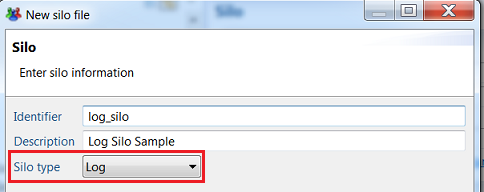

Configure the silo the collect parameters by choosing an audit log collect line and file iteration parameters.   
You must then select the Logs-Ledger matching policy to use for that silo (cf. § **Logs-Ledger matching policy** ).  

| **Running and debugging an audit log silo**    You run and debug an audit log silo the same way as you run and debug a regular ledger silo,  except that there is no dialog box for selecting/creating a sandbox or a timeslot,  so the execution starts immediately after clicking the button.

## Audit Log Collection Lines

Audit Logs collection lines allows to collect data related to audit log targets and to insert it into the database.   

An audit log collection line differs from a regular ledger collect line in the following ways:   

- An audit log collection line can only be referenced in an audit log silo whereas a regular collect can only be referenced in non-audit log silos.
- An audit log collection line can only target Audit Logs whereas a regular collect can target all ledger resource types (identities, organizations, etc.). The target palette in the editor is updated accordingly.
- An audit log collection line (resp. ledger collect) can only reference other audit log (resp. ledger) sub-collects.

To collect audit log data, you do the following:   

- Create an audit log collection line
- Include some source or discovery component to load the log data extracted attributes
- Optionally add some postprocessing and logic to transform the extracted data to the expected format
- Add an audit log target component to gather the data and insert it into the database
- Map the extracted and computed attributes to the audit log target standard fields

### Create an Audit Log Collection Line

To create an audit log collect line, do the following:

- Check **The collect target logs** box in the collector creation dialog box

- The collect line editor is displayed with specific logs components:   
  - **Logs target** target component
  - **Logs Processing** filtering component

The logs collect line will typically include a source of data, one or more intermediary components to process and enrich the source data and a final audit log target component to insert the enriched data into the database.   

### Add an Audit Log Source

Audit logs source data can be any suitable source of logs data.   
This is typically a CSV file containing raw logs data, provided by a an external discovery component.

### Process Audit Logs

Audit logs source raw data must be enriched and processed before being inserted into the database.   
Processing typically consists of:

- Normalizing values (dates)
- Adding hard-coded values ( such as event family )
- Replacing event code-fields by readable labels (ie ActiveDirectory "4722" event code by: "An user account was enabled")
- Computing contextual labels describing the event (ie "a security-enabled group was created: "Finance" )
- Computing Formatted presentation of event custom properties

These processing can be achieved as usual using **Update** filter component with javascript expressions and/or **Join** processing with event tables.   
This approach is suited when working with small to medium volumes of logs data.

### Work with Log Processing Component

The recommended approch to process large volumes of log data is to use the " **Logs Processing**" filter component which is dedicated to the processing of logs data and ensures high-speed performance while offering enough flexibility.

To add a **Logs Processing** step to your collect, drag it from the Filters drawer of the palette, and insert it between the source and the target.   
Then select the component to configure it:

Logs Processing configuration consists of the following:   

- **Event Properties file** : path to a csv file describing the different events types and their properties
- **Log Attributes Mapping file** : path to another csv file defining the values of audit logs target  expected attributes
- **Event id attribute** : name of the attribute holding the event type in the source dataset.

Event Properties File format:   
The **Event Properties** file describes the events expected in the logs data files.   
It must follow the formatting rules below :   

- Input CSV file with semicolon separated fields.
- One row in the CSV file per event type
- Identifying columns:  
there are 4 mandatory columns decribing the event :
  - **eventid** :  the identifier of the event "type". Values must match event id values in the source discovery. (eg. SMB\_RD, 1248, etc. )
  - **message** :  a readable short sentence describing the event type (eg. "Read File", "User Logon", etc.)
  - **category** : category name of the event, to help organize hundreds of event types
  - **subcategory** : optional sub-category to help organize the event
- Event-specific columns:  
Each event may have a number of specific properties that are defined only for this event type (e.g. name of new file for "rename file" event, name of target group for "move account" event, etc.).  
If present, these specific properties are provided by an attribute of the dataset that must be named **properties** and formatted as pipe "|" separated list of values.  
In this case, the **Event Properties** file will have n columns for that event, each column defining the **name** of the specific property for that event.  
The Event Properties file being tabular, it will have at least N additional columns, numbered 1, 2, N where N is the maximum number of specific properties for any given event.   

The figure below shows an example of Event Properties file with 4 events:   

- event #1 has type "RD", label "Read File" and 2 specifc properties named Offset and Length
- event #3 has type "REN", label "Renamed File" and 1 specific property named New File
- event #4 has type "DEL", label "Delete File" and no specific properties.

**Log Attributes Mapping file:**   
The **Log Attributes Mapping** file defines the values of all log target attributes for each event type.   
Each value can be either static , or based on the source dataset attributes and/or event-specific properties.   

The file must follow the formatting rules below:   

- CSV file with semicolon-sepatated values
- One row per event type
- Must have the following 49 columns ( case sensitive):

|eventid|id of the event, must match same entry in the Event Properties file|
|description|Description of the event. This is a reminder for the designer when filling the other cells. The value is not used|
|log\_mandant|value for the mandant attribute. See Audit Log target attributes below for the meaning.|
|log\_datasource|same as above|
|log\_externalref|same as above|
|log\_family|same as above|
|log\_date|same as above|
|log\_wheresource|same as above|
|log\_wheredestination|same as above|
|log\_whologin|same as above|
|log\_whorepository|same as above|
|log\_whoidentity|same as above|
|log\_whosessionid|same as above|
|log\_whateventcategory|same as above|
|log\_whateventcode| same as above|
|log\_whateventcodelabel|same as above|
|log\_whataction|same as above|
|log\_whatpayload|same as above|
|log\_whatstatus|same as above|
|log\_whatcount|same as above|
|log\_whatdisplayname|same as above|
|log\_whattargettype|same as above|
|log\_whattargetname|same as above|
|log\_whattargetparent|same as above|
|log\_whattarget2type|same as above|
|log\_whattarget2name|same as above|
|log\_whattarget2parent|same as above|
|log\_whatoldvalue|same as above|
|log\_whatnewvalue|same as above|
|log\_whatdata|same as above|
|log\_custom1|same as above|
|log\_custom2|same as above|
|log\_custom3|same as above|
|log\_custom4|same as above|
|log\_custom5|same as above|
|log\_custom6|same as above|
|log\_custom7|same as above|
|log\_custom8|same as above|
|log\_custom9 |same as above|
|log\_custom10|same as above|
|log\_custom11|same as above|
|log\_custom12|same as above|
|log\_custom13|same as above |
|log\_custom14|same as above|
|log\_custom15|same as above|
|log\_custom16|same as above|
|log\_custom17|same as above|
|log\_custom18|same as above|
|log\_custom19| same as above|

Each cell of the CSV file defines the value of a given log attribute ( column) for a given event type (line) using  syntax below. It can be left blank for no-value.   

| **Type of Content** | **Syntax** | **Example** |
| static content | string | File Access |
| value of an attribute from   the source discovery | name of the attribute enclosed in braces | {timestamp} |
| value of a column from   the event properties file | {category}, {subcategory} or {message} |  {category}|
| value of an event-specific property | name of the specific property, prefixed by param.   and enclosed in braces | {param.NewFile} |
| formatted string of   all specific properties |  {formattedRawData} | Example of output:   Subject:  &emsp;Security ID:  SYSTEM   &emsp;Account Name:  WIN-R9H529RIO4Y$    &emsp;Account Domain:  WORKGROUP   &emsp;Logon ID:  0x3e7   Logon Type:10   New Logon:  &emsp;Security ID:  WIN-R9H529RIO4Y\Administrator   &emsp;Account Name:  Administrator   &emsp;Account Domain:  WIN-R9H529RIO4Y   &emsp;Logon ID:  0x19f4c   ...|
| combination of the above |  mixing static and variable content |  {message} {file} to {param.NewFile} |

Below is a partial screenshot of the corresponding event mapping file from the previous example:   

The full event properties and event mapping files for this example can be found in the attached **bw\_logs\_doc\_0.1.facet** file.   
Otherwise, you can copy/paste the text below to create template files:

eventproperties.csv:   
`eventid;message;category;subcategory;1;2;3;4;5;6;7;8;9;10`   

eventmapping.csv:   
`eventid;description;log_mandant;log_datasource;log_externalref;log_family;log_date;log_wheresource;log_wheredestination;log_whologin;log_whorepository;log_whoidentity;log_whosessionid;log_whateventcategory;log_whateventcode;log_whateventcodelabel;log_whataction;log_whatpayload;log_whatstatus;log_whatcount;log_whatdisplayname;log_whattargettype;log_whattargetname;log_whattargetparent;log_whattarget2type;log_whattarget2name;log_whattarget2parent;log_whatoldvalue;log_whatnewvalue;log_whatdata;log_custom1;log_custom2;log_custom3;log_custom4;log_custom5;log_custom6;log_custom7;log_custom8;log_custom9;log_custom10;log_custom11;log_custom12;log_custom13;log_custom14;log_custom15;log_custom16;log_custom17;log_custom18;log_custom19`

### Add an Audit Log Target Component

The collect chain must end with a **Logs target** component so that the logs data are recorded in the database.

To insert a Logs Target in the collect line, drag the **Logs Target** item from the palette item to the collect editor area.

### Map Target Fields to Collected Attributes

To provide values to insert in the database, you must map fields of the Logs target to the available collected attributes.   
You don't need to map all fields, however some fields are mandatory.

To map target fields to attributes do the following:   

- Select the target component
- Open the properties view
- Select the Mapping tab
- Select an attribute in the **Collected Attributes** column for each field to be mapped.

An Audit Logs Target data consists of 28 standard fields that fit most common audit log use cases plus 19 custom fields for additional purposes.   
That table below lists the target standard fields, along with their meaning and example values.   
Mandatory fields are marked with an asterisk.   

**Audit Log target fields**

|**Attribut**|**Label**|**Meaning**|**Example**|
|mandant|Tenant|In a multitenancy architecture context, refers to the tenant the logs are associated to. Can be left blank otherwise|acme\_corp|
|datasource\*|Data source identifier|Data source unique identifier (connector address, etc.)|AD-cnx-ACME|
|externalref|external unique identifier|External identifier of the event , unique within its datasource,  allowing to refer to the original event|45789|
|family\*|family|Event family that conditions the meaning of the other attributes|filer,securityadmin  systemevent, etc|
| **when** |
|date\*|date|Event date and time in YYYYMMDDHHMMSS LDAP format|20151205121542|
| **where** |
|wheresource|source|DNS name or IP address where the user connected from|source.acme.com|
|wheredestination|destination|DNS name or IP address of the machine the user connected to|destination.acme.com|
| **who**|
|whologin\*|Initiator account|User account that initiated the event|jdoe25|
|whorepository\*|Initiator account domain|Repository or domain of the user account   that initiated the event|ACME|
|whoidentity|Initiator identity|Identity associated to the account, if available eg. from an SSO|john doe|
|whosessionid|User session id|User session identifier during which the event occurred,  useful for correlating events in the same user session.|0x45679|
| **what** |
|whateventcategory|category|Event category within a given family|Account Management|
|whateventcode\*|code|Event technical code, should be unique within a given event family|MS-4770|
|whateventcodelabel\*|code label|Event code generic label|New account created|
|whataction\*|action|Action taken, such as read, write, execute...|read|
|whatpayload|payload|Business payload of the event (eg. order amount)|75000|
|whatstatus|status|Action result code. Possible values are success/fail| success   fail|
|whatcount\*|count|Event number of occurrences if several events are consolidated as one.  Set to 1 otherwise|10|
|whatdisplaylabel|Display label|Contextual label for the event|New account created ACME\admin|
|whattargetype|Target type|Resource type of the event's target. Allowed values are:   **account, identity, group, organisation, asset,  application, permission, repository, perimeter**|account|
|whattargetname|Target name|Name of the event's target resource|john\_doe|
|whattargetparent|Target parent|Name of the event parent if relevant. Depending on the target type, the parent may be a domain, a share, a repository, a parent organization, or whatever information allows to identify the target|CORP|
|whattarget2type|Secondary target type|Type of the secondary target, in case the event implies two resources. For example, adding a group to another. Allowed values are:  **account, identity, group, organisation, asset,  application, permission, repository, perimeter**|perimeter|
|whattarget2name|Secondary target name|Name of the secondary target resource|Sales division|
|whattarget2parent|Secondary target parent|Name of the secondary target's parent, if relevant|Sales division|
|whatoldvalue|Old value|Previous value, when the event implies the change of some value|Locked|
|whatnewvalue|New value|New value set in the event|Standard|
|whatdata|data|Event additional information as a JSON structure.|{  "subject":{   "login":"jdoe", "name":"john doe"} }|
|custom1 ... custom19|Custom   fields 1 to 19|19 custom additional fields|

\* mandatory items

## Logs-Ledger Matching Policy

In order to enable cross-linking in web pages between logs information and Ledger information, entities involved in the logs must be matched with their counterparts in the Ledger.   
This includes for example the log event initiator account (the "actor"), and logs targets such as account, groups, applications, etc.

The criteria to match logs and ledger entities depends on the way entities are represented in the logs.  
For example:   

- actors in ActiveDirectory admin events are represented as SIDs,
- groups and accounts targets in ActiveDirectory admin events are mapped as Domain/Name
- actors in ERP transaction logs may be mapped as HR codes
- etc...

A **Logs-Ledger matching policy** consists of a set of **Logs-Ledger matching rules** that must be applied in a given order to logs entities.   
The policy is then associated to one or more log silos so that it will be applied to the log entities computed in these silos.   

To create a **logs-Ledger matching policy** , do either of the following:   

- Select **New**... **Logs-Ledger matching policy** from the Audit Project panel
- right-click on the **logsmatching** directory and select **New Logs-Ledger matching policy**...

You can then add one or more entries to your policy.   
For each entry you must provide the following information:   

- **Log Entity to match** : the log entity typeto apply the rule on. Select one value of :
  - **actor** , if the rule must applies to log actor entries
  - **identity** , **account** , **permission** , or any allowed target entity type  
  - **Untermined type target**  if the log entity type to match is not known yet and is to be determined through matching. In this case, the eventual type of the log entity will the one of the first Ledger entity that matched.   
     
- **Rule** : the logs-Ledger matching rule to use. You must select an existing rule of the selected log entity type, or any rule if "undetermined type" is selected. If the rule does not exist, you must create one first.   

- **Display method for this entity** : select a method to compute a display name for the matched entity. This display name will be used when displaying logs entities, which is more readable that say the account SID.

   

To create a **logs-ledger matching rule** , do either of the following:   

- Select **New**... **Logs-Ledger matching rule** from the Audit Project panel   
- right-click on the **logsmatching** directory and select **New Logs-Ledger matching rule**...   

The Logs-Ledger matching rule creation resembles that of any other audit rule (eg. entitlement model rule, etc... ).   

The matching rule has 2 generic parameters.  The meaning of these parameters depend on the usage of the rule (actor vs target)   

- **log entry param #1** : this parameter will contain the login, when used with actors and the log target name when used with targets
- **log entry param #2** : this parameter will contain the repository name, when used with actors and the log target parent name when used with targets   

Below is an example of a rule that maches log actors to ledger accounts through their login and repository.   

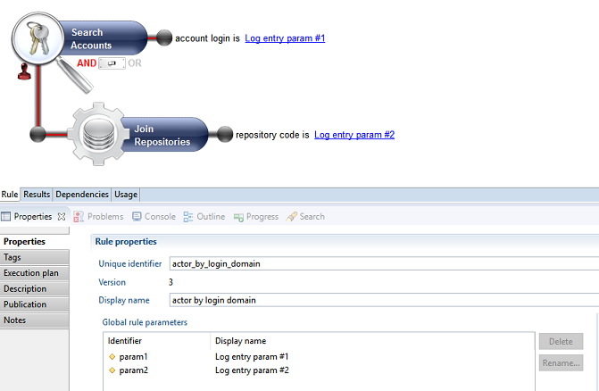   

## Audit Log Execution Plan

You can execute audit log silos extractions and collect lines as a whole from the **Logs execution plan**.   

Only logs that have not been excluded from the configuration will be executed.   

You can run the audit log execution plan by clicking the **Run execution plan** link in the **Logs** section of the main project view.   

   

Alternatively, you can also view the execution plan to check its content before runnning it.   
To open the execution plan view, click **Open execution plan** in the Logs section of the project view.   
This will open the **Logs Execution plan** view.   

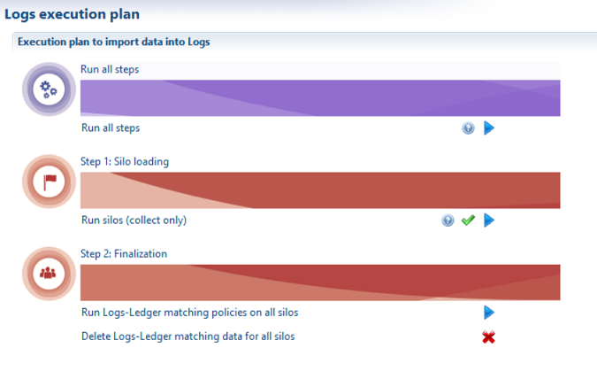   

From this view, you can carry out the following tasks:   

**Run All Steps:**  

- click the question mark icon to check the list of logs silos to be executed, along with their dependencies
- click the arrow icon to run all log silos collects, then the associated logs-Ledger matching policies.

**Step 1: Silo Loading**   

- click the question mark icon to check the list of logs silos to be executed, along with their dependencies
- click the check icon to run a sanity check on logs silos
- click the arrow icon to run the logs silo collects only.

**Step 2: Finalization**    

- click the arrow icon to run the associated logs-Ledger matching policies only.
- click the cross icon to delete all logs-Ledger matching data previously computed and stored.  
This could be helpful if matching policies have changed and you would like to run the new policies over.

In production, you will preferably schedule the logs execution plan to run automatically on a regular basis from the command line.   

A new batch command have been provided for that purpose. It's located in iGRC installation root directory:   
`<igrc_home>\igrc_auditlog.cmd`   

The batch file excepts 3 parameters and works similarly to igrc\_batch.cmd   

Example:   
`./igrc-auditlog..md <project name> <config folder> <config name>`

## Check Log Collect Results

You can check the data that have been recorded in the logs database directly from within iGRC using the **Logs viewer** tool.      
You can perform multi-criteria search on date interval, family, code, initiator account, user session id and display label, and access the details of each log event recorded.     
The results can be exported as a CSV file.

To use the Logs Viewer tool, do the following:   

- Make sure the project is opened
- Select or open the project view on the left side bar  
- Click the **Show Logs**  link in the **Logs**  section   

   

This will display the **Audit Logs view**    

  

- You can search for audit logs according to multiple criteria:
  - Date range:  type a date or select from the calendar. The range of the search is **From** date 00:00 until **To** date 23:59:59.    
  Try to select a date range as narrow as possible (one or two days) to have a good response time.
  - Family: family of the event, you can select one possible value from the drop down menu
  - Code:  code of the event, you can select one value from the drop down menu
  - Initiator account login:  type first letters of account , then ctrl-space to get possible values
  - Session Id: this is typically the windows session id where the action took place.  You can copy the value by right-clicking Session Id value in the detail panel.
  - Label:  search for a text pattern in the event display label.  Use "\*" as a joker.  For example type **"password"** to search for label containing the word "password".
  - Click **Search** to start the search.  The button will be grayed until the search is complete.    
   
- Once the search is complete, the result is displayed in the table:
  - Only the first 1000 rows are displayed.  The total count is also limited to 9,999 to save performance.
  - Right-click anywhere in the table and select **Export in CSV** to export to content of the table to a CSV file
  - You can click on a table row to display the event's details in the right panel.    
Note that only non null fields are displayed, so some fields may be missing if they don't have a value for that event.
  - Right-click a field value and select **Copy** to copy its value to the clipboard.

  

## Known Limitations

### Multi-Node not Supported

You cannot run multiple audit log batch commands in parrallel.   
This may lead to unpredictable data loss where part of the logs data will not be inserted in the database!

### Event Uniqueness

Make sure that your log data does not reference two log event types with the same ID but different labels (for exemple "read"/ "Read File" and "read" / "Read Permission")   
To prevent this, you may have to prefix the event id to make sure it's unique.   
Would this ever happen, you would get an SQL error when inserting data into the database, something like:   
_Cannot insert duplicate key row in object 'igrc.taudit\_devent' with unique index 'IX\_name\_cat'_

## Downloads

[bw_logs_doc_0.1.facet](https://download.brainwavegrc.com/index.php/s/NGr4bnLeTRWeeao)

# Set up Audit Logs

## Prerequisites

Software versions:

- iGRC Platform 2017 R1 or later
- Microsoft SQL Server 2008 or later

## Create the Database in SQL Server

To ensure maximum storage efficiency and access performance, Audit Logs data should be stored on a database instance different than the main Audit Ledger database. In all cases, audit logs data must be contained in its own database schema which must be named **igrc**.

This is the procedure to create the database and the igrc schema in SQL Server Management Studio 2012 :

- Start SQL Server Management Studio and connect to database server
- First, Create a new database
  - Give it a name, eg. **Igrc\_logs**
  - Set the auto-growth and initial size parameters according to your needs (here 100 MB growth / 100MB initial size)
  - (Optional) In order to reduce the storage space used by the database you can choose to set the Recovery model parameter to **Simple** and the Auto-shrink parameter to **True**  

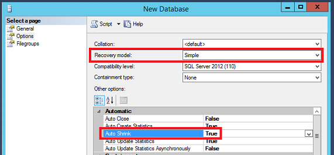

  - Next, create a login to connect to the database:
    - Go to Root \> Security \> Logins
    - Select New Login...
    - Fill-in information regarding the login
      - Give it a name
      - Select **SQL Server Authentication** and enter password
      - Uncheck **Enforce password policy**
      - Set default database

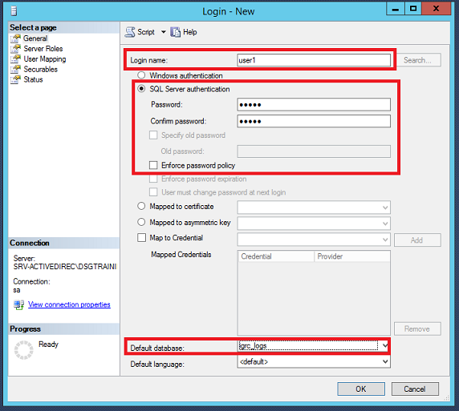

- Assign predefined Server Roles to the user
  - public
  - bulkadmin\*

| **Note**    The **bulkadmin** role is optional but recommended. It is required to allow high-rate insertion in the database for very large volumes of data (See **Advanced database configuration**  section below for details).|

- Create igrc database schema and allow the login to use it
  - Check the **Map** box for the igrc\_logs database to map the login
  - Type **igrc** in the Default Schema column to create and allow the igrc schema
  - Assign **db\_owner** role to login for igrc\_logs database  

| **Text Box**    Alternatively, you can apply these steps to an existing login, for instance to use the one connecting to the Ledger database.|

## Configure the Database Connection

You must now configure iGRC to connect to your newly created database.   

In order to do so, carry out the following steps:

- Make sure iGRC is started and your project is opened
- Open the technical configuration you wish to modify (here **default** )
- Select the new **Logs** tab to enter the configuration

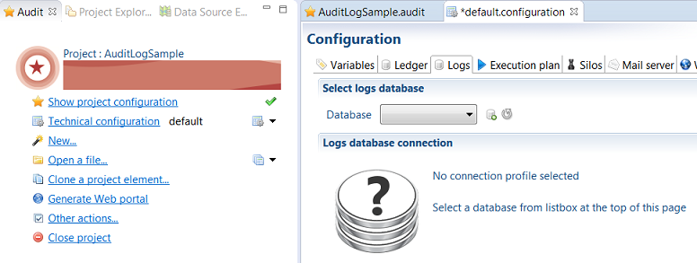

- To configure a new database profile that points to your database, do the following steps:

- click the  icon to the right of the Database menu to open the **New Connection Profile** wizard.
- Select **SQL Server** as the database type and give a name to the profile (eg.**AuditLogDB**)

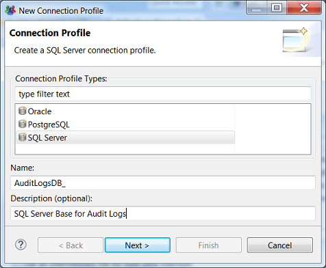

- Fill in the connection parameters to the database (database name, host, port number and credentials) to match the ones defined in the SQL Server database

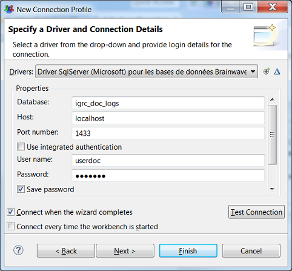

- Click **Test Connection** to check that the database can be actually reached.
- The message **Ping succeeded!** is displayed.
- Click **Finish** to create the connection profile and get back to the configuration
- The database is reachable and the newly created profile is selected.

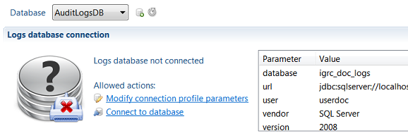

## Initialize the Database

The database must now be initialized for storing and managing your audit logs data.  

To initialize the database, do the following:  

- Make sure the correct database profile is selected in the menu
- Click **Connect to database** link
- Since the database structure is not present yet, the following options are displayed :

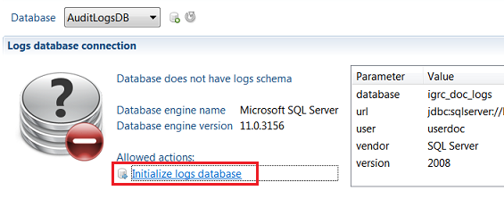

- Click the **Initialize logs database** link to display the initialization parameters dialog box:

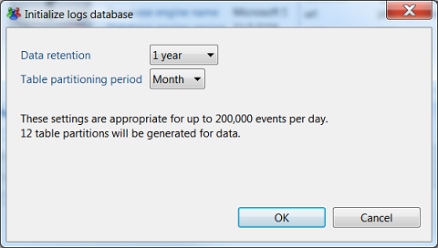

This dialog box allows you to set sizing parameters for the database.  
These parameters must be set carefully to ensure efficient storage and retrieval of data.  
Moreover, once set and data inserted, it is not possible to change the parameters without first deleting all database
Make sure to account for both your current and future needs when setting the values.

- **Data retention** : this parameter indicates for how long Logs data must be stored in the database. Data that exceed the retention period are replaced by newly inserted data.   
Available values and the corresponding retention period are the following:
  - 1 month : 30 days
  - 3 months : 90 days
  - 6 months: 180 days
  - One year: 365 days
  - 2 years: 730 days      

- **Table partitioning period** : this parameter determines how the data will be broken down between different tables to ensure optimal performance (this mechanism is called _data partitioning_). The appropriate partitioning period depends on the maximum number of daily events to be stored in the database according to your current and future needs.  
The following values are available:
  - **one month** period: appropriate for up to 200,000 events per day.
  - **one week** period: appropriate for between 200,000 events and 1,000,000 of events per day.
  - **one day** period: appropriate for 1,000,000 and above events per day.   

- Click OK to create the database structure.   

The database is now ready for storing collected logs data.

## Advanced Database Configuration

### Enable Bulk File Database Insertion

When dealing with millions of log events per day, the processing time of collected data is key to ensure timely availability of audit log information and analysis.

Using an intermediary file for bulk data insertion is a database mechanism that may speed up the overall collect time by a factor or 4.
When enabled, iGRC collect process will write the whole data to insert to a single huge file at a given location and the database process will read from this file the data to be inserted.

To enable this option, do the following:   

- check the **Use an intermediary file for bulk data insertion** box   

- In the **Bulk files folder's path** field, type the path, without the ending slash, of the directory where iGRC will write bulk files. This directory can be on a local disk or on a remote location, and the iGRC batch process must have **write** permission to it.   

- In the **Folder's path as seen from the database** field, type the path of this same directory, as seen from the database server. It can be on a local disk or a remote location, and the database process must have **read** permission to the directory.  

- Optionally, check the **Keep the bulk files upon insertion** box so that the bulk file is not automatically deleted once the insertion is complete. This option can be useful for debugging purposes, to check what has been inserted, but should not be enabled in production.

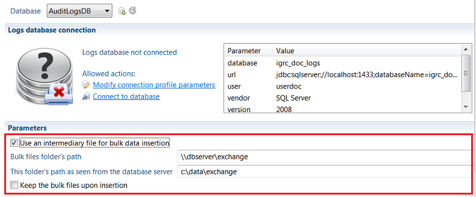

# Work with Audit Logs

You can use audit log data in various context and for different purposes:

- Multi-criteria search on audit logs to answer questions "who have done what and when":   
  - Who read/deleted this file ?
  - What files were accessed by J. Doe 3 months ago?
  - What transactions have been performed by J Doe on the payment system?
  - Who changed the CEO password ?
- Provide data to compute **Usage**  metrics and perform Analysis on User Behavior such as:   
  - Do I have people who are not part of the HR department and who accessed sensitive HR data on sharepoint?
- Ad-hoc reports to answer auditors requests

Whether it be displayed in web pages or PDF reports, or be used to compute Usage data, retrieving audit log data will use two different mechanisms:

- **Audit Logs View**  is used to load filtered logs data to be used in web pages, reports, and workflows.
- **Audit Logs Source** is used to retrieve filtered logs data within Usage collect line.

## Audit Log Views

An **Audit Logs View** is similar to a Ledger View: it wraps a given query on audit logs with a given set of result columns and parameters so that it can be used elsewhere (pages, reports or workflows).   
The query is designed graphically using the view editor.   

There are two different types of audit log views:

- **log view** :  view that loads audit logs events
- **log resource**  **view** : view that loads resources involved in audit logs events :
  - as an event's characteristic:  mandant, datasource, family, actor, action, code, host, status,
  - as an event's target: account, permission, repository, asset, application, perimeter, identity, organization,  group

A log view differs from a Ledger view in the following ways:   

- A log view has an \*.logview file extension
- A log view does not depend on timeslots. However it requires a date & time range parameter
- A log view is automatically sorted by date, ascending. It's not possible to sort on a different criteria
- You cannot join audit logs data with other ledger resources or log resources.  Instead, all external references are available as direct attributes of the view

A log resource view differs from a Ledger view in the following ways:   

- A log resource view has an \*.logview file extension
- A log resource view does not depend on timeslots or date ranges.  The view will load resources that ever existed in the database
- A log resource view cannot be mixed with other resources in the ledger although it may be the same

### Create an Audit Log View

To create an audit log or log dimension view, do the following:

- From the main **Project** panel, Click **New...** then select **Log View...** from the analysis section  

- Alternatively, from the **Project Explorer** panel, right-click the **views/** directory or one of its sub-directories, then select **New... \> Log View...**

- Select the location for the file, give it an appropriate file name,
- Fill in information on the view: identifier, display name and select **Logs** from the **View is on** menu  

- Click **Finish** to open the editor on the newly created log view  

- Drag and drop the attributes to include in the view from the **Attributes** palette to the Log(s) component:  there are 33 attributes and 19 custom attributes.  
Note that attributes of referenced resources (such as whologin , codelabel, targetparent, etc. ) are available _directly_ as attributes of the view.  
Here is a sample view:     

### How to Parameter an Audit Log View

The **Properties**  tab in the view's properties panel allows you to define external parameters for the view.   

Log views have two predefined mandatory parameters **beginDate** and **endDate** to control the log view's date range to load.     
These parameters are automatically mapped to the Log dates of the view and should not be deleted.  

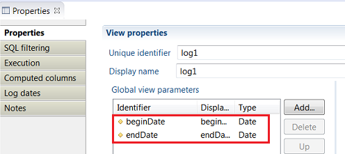

You can add more parameters to the view to fit your needs.   

The **Log dates** tab allows you to map the view's date range to views actual parameters.  It's pre-configured to map beginDate and endDate parameters and should not be changed in normal use.   

### Display View Results

To test your view against the database, you need to provide test values for beginDate and endDate in the **Test values for selected parameter** field.   
Use **YYYYMMDD** format for date values and **YYYYMMDDHHMMSS** for date and time values.   

To display the view's results, click the **Results** tab:

- To refresh the view results, click back on **View** tab, then **Results** tab
- To export the view's results as CSV file, right click inside the table and select **Export in CSV...**

### Create a Log Resource View

To create an audit log resource view, do the following:   

- Create a new log view either from the project view or from the explorer view
- Select the location for the file, give it an appropriate file name,
- Fill in information on the view: identifier, display name and select log resource type from the **View is on** menu  

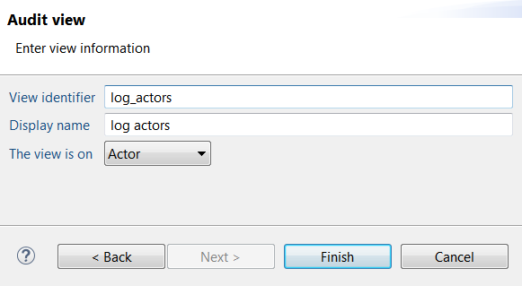

- Click **Finish** to open the editor on the newly created log resource view  

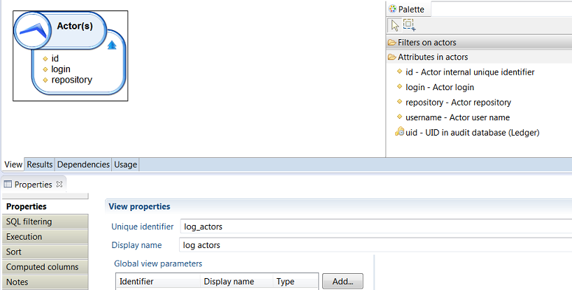

- Drag and drop the attributes to include in the view from the **Attributes** palette to the Log(s) component. The list of attributes depend on the log resource type
- You can set a different sorting order for rows from the **Sort** tab
- Click the **Results** tab to display the view contents  

### Include Audit Log Views in Pages

You can display the content of a view inside a page  as you would with a regular Audit view, using a DataSet.

## Audit Log Source

An **Audit Logs Source** is a collect source component that can be used to compute ledger resources based on audit logs data.   
This will typically be used to compute usage metrics.