# Table of contents
{: .no_toc .text-delta }

1. TOC
{:toc}
---

# Generation of a Collect Line

The data collection wizard provides the user with a dedicated interface to map the original import data to attributs in Brainwave's data cube. The product will then automatically generate the corresponding data collection lines.

The generated elements can then be used out of the box to run an execution plan. Further customizations to the generated files can be applied if needed, thanks to the high customization capabilities of Brainwave.

The following paragraphs detail the process from the design of the application model to the launch of generated collect:

* Step 1: Configure the mapping between the import data and the data cube

* Step 2: Generation of the data collection lines

* Step 3: Customize and/or adapt the generated data collection lines

* Step 4: running an execution plan

---

**Note:** In the following pages the terms **collect** and **application model** are used interchangeably and have the same meaning.

---

## Create a New Application Model

### Prerequisites

The data collection wizard is included in an add-on called `bw_appmodeltemplates`.

This add-on is not included by default in the product and must be downloaded from the marketplace [here](https://marketplace.brainwavegrc.com/).

The installation of the add-on provide the access to the data collection wizard. 

### Application Model

Once the `bw_appmodeltemplates` add-on installed, you can access the wizard to generate an application model in the audit menu: "New..."

This menu opens a dialog box to create an application model file with the extention `.appmodel`. This file contains all informtaion relating to the application model.

The `.appmodel` file must be located in the 'silos' folder.

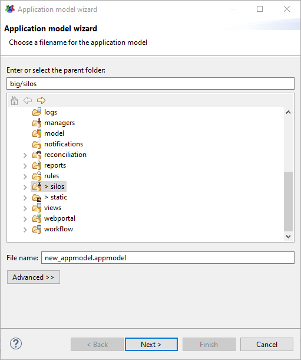

The next dialog allows the configuration of the application model, including: 

- The application model identifier
- The selection of the Application model template

The application model identifier will be used as a silo identifier and, as such, it must be unique in the project. Please note that the identifier can not be changed once the wizard is finished.

The identifier is also used to create all necessary folders in the project (silos, collectors...).

### Templates

The application model include a series of templates that determine the structure of the generatied data collection lines.

The list of application models will increase as the `bw_appmodeltemplates` Add-On evolves in time. As is stands the add-on includes :

- An HR model to create data collection lines for HR information
- A Repository model to repositories, accounts, groups and groups members.
- A Right model template to load accounts, permissions and rights.

For more information on the included data models please refer to the following pages:

[Aplication model templates]({{site.baseurl}}){: .ref}

## Build

Once the creation wizard dialog completed the application model editor is opened.

This editor allows the collect designer to define the collect mappings, the configuration of the silo and so on.

For more information on the configuration of the application model editor please refer to the following page:

[Aplication model templates]({{site.baseurl}}){: .ref}

Once all configuration completed the Build tab allows the user to generate all data collection lines and the documentation.

The following screenshot shows the Build tab:

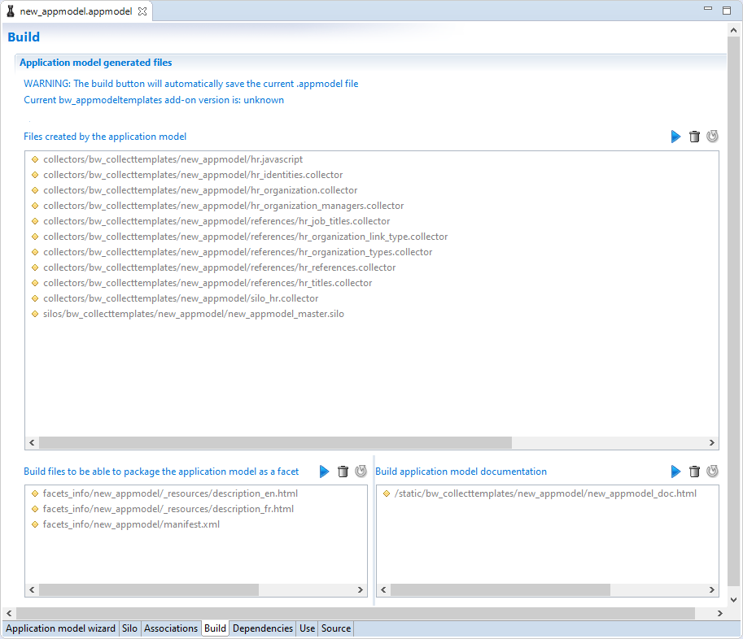

## Execution Plan

Once all the previously described steps have been completed it is possible to launch an execution plan to load the data to brainwave ledger.

# Attribute Mapping in Discovery File

In order to configure the mapping between the data in the import files and Brainwave's data cube a new editor has been added:

- The Discovery editor

In the following chapter the configuration on this new tab is detailed.

## Discovery Mapping

As detailed a new concept has been added to discoveries: The discovery mapping. It allows the user to configure the links between the ledger entities and the attributes in the discovery.

This will then be used in the data collector wizard association tab to map the attributes with the application model entities.

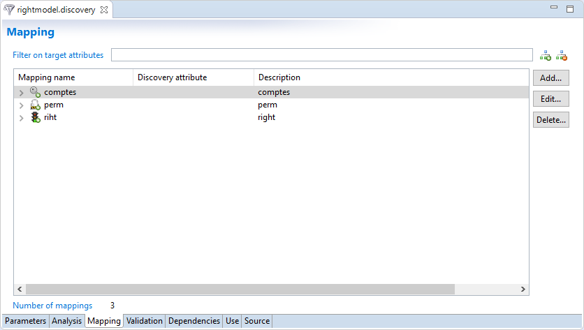

A mapping is characterized by the following attributes:

1. Name: The identifier of the mapping
2. Description: To understand the goal of the mapping
3. Type: Contains entity type ex( Account, Applications, Repository...)
4. List of attributes mapping: list of links between discovery attributes and collect entity fields

## Tree mapping editor

The mapping component allows the definition of links between attributes in the discovery file and a attributes in the ledger graphically.

To create a link, simply drag and drop from left tab, representing the attributes in the import file, to right tab, attributes in the data model.

Clicking on a link highlights it and helps identify the source and the destination attributes.

To delete an attribute mapping double-click on the link.

The editor includes the follwing:

1. Discovery attributes: The list of import, calculated and silo attributes 
2. Ledger attributes: list of attributes existing in the data cube corresponding to the selected entity
3. A Button that allows to sort the linked attributes
4. The graphical Link between left and right tabs attributes
5. List of silo attributes that is included with the discovery attributes in the left tab

## Attribute mapping

An attribute mapping is a link between a discovery attribute and a ledger entity attribute configured in the discovery mapping.
The list of ledger attributes displayed is dependent on the configuration of the mapping type.
For example when "Applictaion" is selected then only attributes corresponding an appication in the ledger is displayed: 

In the configuration of the mappings different types are possible

### Dynamic Mapping

Dynamic mappings are created using the mapper component where the attribute in the ledger is linked to a value returned by the discovery.

### Static Mapping

Static mappings are ledger attributes that need a static value and can not be linked to attributes from the discovery.

Theses are dependent on the selected destination entity.

### Events

This section allow to activate and configure events related to ledger attributes. Theses are dependent on the selected destination entity.

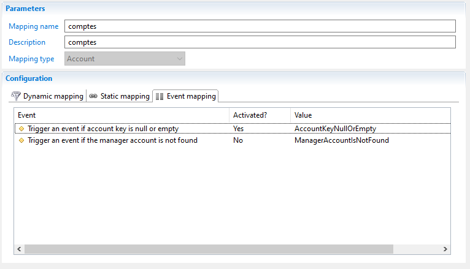

### Attribute Mapping Description

It is recommended to fill out all attribute mapping descriptions. These descriptions will be used to populate the application model documentation that can be exported

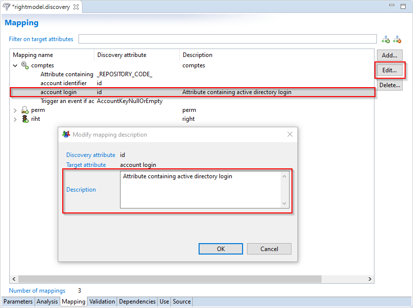

Please see [here]({{site.baseurl}}#generate-documentation) for more information. 

# Application Model Editor

This chapter described the tabs of the application model editor. This allows better understanding of the settings and the impact of the different configurations on the generated collect files.

## Application Model Wizard Tab

This first tab displays a reminder of the information provided during the setup wizard dialogs.

---

**Warning**: The identifier of the application model is **not** editable and must **not** be changed.
Once the setup wizard dialog has been validated, the identifier used to create folders, to patch files...

The only way to change the identifier to delete the application model and create a new one.

---

The `Description` field is used in the documentation that can be automatically generated. The best practice is to fill out this field with a description of the desired data model.

Please see [here](#generate-documentation) for more information. 

## Silo tab

This tab is used to define the main silo settings:

Each application model will generate a silo file, called `identifier_master.silo`. The identifier used to create this file is the application model identifier.

In this tab you will find all fields that are in the standard silo editor including :

- The silo parameters: Identifier, Display name, Silo type and dependencies
- The importfile itteration parameters
- The silo constants

## Associations tab

This is the main tab and allows the user to configure the associations between the application model and the ledger identites loaded.

The editor is seperated in fields that allow the user to:
- Associate all the pre-configured mappings to the application model
- Set the application model variables values
- Preview the data model schema
- Consult the user guide

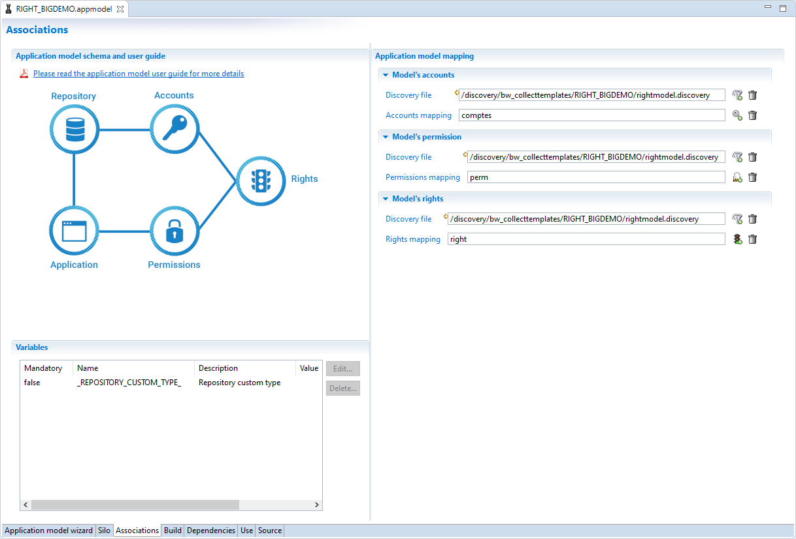

### Application Model Schema and User Guide

This field provides the user with documentation on the requirements of the application model.

It includes:
1. A PDF user guide to help configure the application model step by step
2. An illustration of the application model schema providing a global view of the data model and the different relations included in the application model

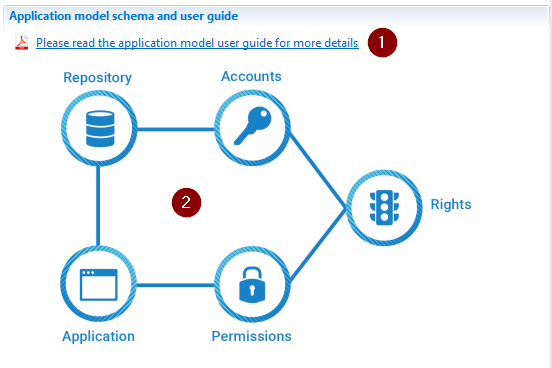

### Variables

In this section variables used in the application model are set.
These can be set to static values or a project variables.

---

**Warning**: When using project variables (__ex:__ `config.fileName`), when exporting your application model after generation, the destination project may not have the same variable. If this is the case then it is recommended to use a facet variable instead of a project variable. 

---

### Application Model Mapping

This section show the different discovery mappings that should be associated with the application model entities.
For each association section you have to: 
- select the discovery file that contain the mapping
- choose the correct mapping type
  
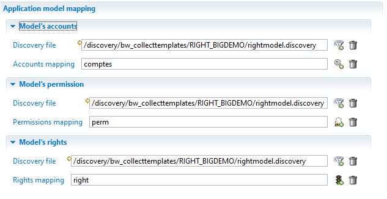

---

**Warning**: If there are missing mandatory attributes in a mapping an error is displayed on the mapping field.

---

## Build Tab

The build tab is to be used once all the configuration of the application model is finalised. This tab allow you to perform the following actions:

- Generate the application model files necessary to launch an execution plan.
- Generate a facet based on the configured application model
- Generate a html documentation of the configured application model

### Generate Application Model Files

This tab is used to build all files necessary to run the execution plan.
In the editor the following elements are displayed:

1. The list of files that will be generated by the product when building
2. The button used to generate and build all files
3. The button used to delete currently generated files
4. The button that is used to refresh files state

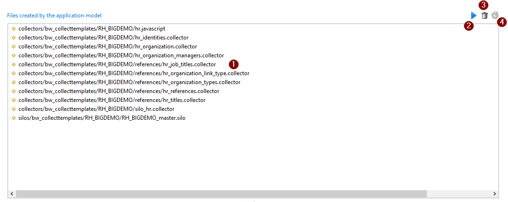

### Generate Facet Files

This section allows the user to generate the files necessary to build a facet based on the configures application model.

Once all files generated please refer to the following pages to build the facet:

[Creating add-ons]({{site.baseurl}}){: .ref}

### Generate documentation

The possibility to automatically generate the documentation of the confifured application model has been added to help the intergrator. This generates an html file that includes the configuration of the mappings implemented through the application model. 

The language in which the documentaiton is generated is dependent on the language of the Studio.

The documentation includes the discovery mappings and application model configuration used by the user.

To improved the quality of the generated documentation it is necessary to fill out the descriptions of the following items:

1. Discovery mapping name and description
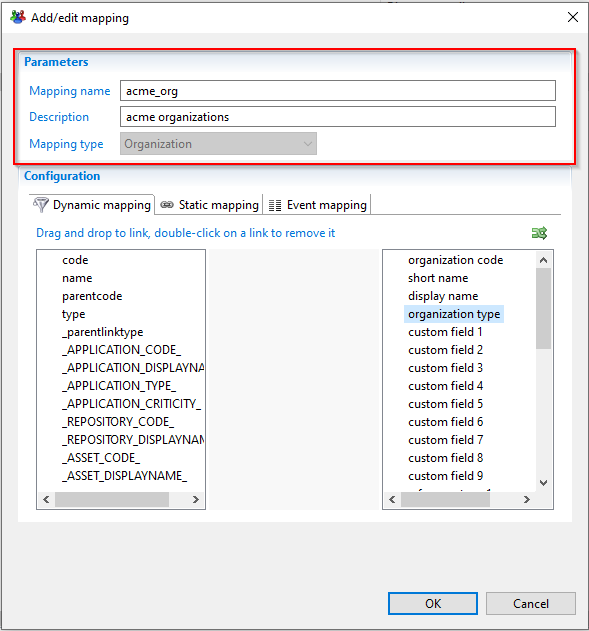

2. Attribute mapping description

3. Application model description

# Application Model Templates

The application model include a series of templates that determine the structure of the generated data collection lines.

# HR Model Templates

The Human Resource application model template allows the generation of collect lines and silos to load organizations hierarchy, identities and organizations managers.

Please follow the steps below to configure your human resources data model.

## Silo Settings

When creating the application model base on the HR template it is first necessary to configure the required elements in the **Silo** tab:

- The silo type
- The dependencies if needed
- The location of the importfiles and the itteration if Files iteration if you want to load several files
- The constants

### Mandators silo settings

In order to correctly configure the following elements are mandatory:

- Repository code
- Repository name

---

**Note:** By default The HR model will create a default repository based on silo repository code and name.

---

## Discovery Mappings

When cofiguring a Human resource type template for an application mode the following attributes are necessary:

- Organization type reference: loads the organization type (__ex:__ Direction, Service...)
- Organization link type reference: loads the organization link type (__ex:__ Hierarchical...)
- Organization: loads the organization (__ex:__ DCOM, DSI, DRH...)
- Title reference: loads the civility (__ex:__ Mr, Mrs...)
- Job title reference: loads the job title code (__ex:__ RD-Ing, DirCom...)
- Identity: loads the identities (__ex:__ employees, contractors...)
- Manager (Organization): loads the organization managers

---

**NOTE:** If a discovery file mapping the desired importfile attributes does not exist it is necessary to create it.

---

### Organization Type Reference

To create an organization type mapping go to the **Mapping** tab and add a mapping of type **Organization type reference**.

The mandatory attributes to map are:

- Organization type code 
- Organization type displayname

### Organization Link Type

To create an organization link type mapping go to the **Mapping** tab and add a mapping of type **Organization link type**.

The mandatory attributes to map are:

- Organization link type code 
- Organization link type displayname
  
### Organization

To create an organization mapping go to the **Mapping** tab and add a mapping of type **Organization**.

The mandatory attributes to map are:

- Organization code 
- Organization displayname
- Organization type
 

### Title Reference (Civility)

To create a title reference mapping go to the Mapping tab and add a mapping of type **Title reference**.

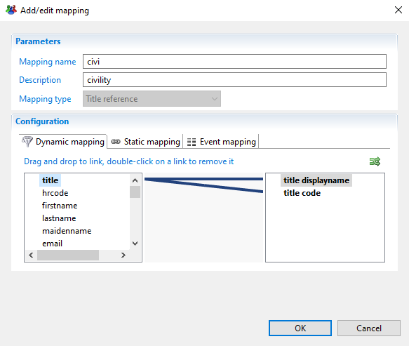

The mandatory attribute mapping to link are:

- Title code 
- Title displayname

### Job Title Reference

To create a job title reference mapping go to the Mapping tab and add a mapping of type **Job title reference**.

The mandatory attributes to map are:

- Job title code
- Job title displayname

### Identity

To create a job title reference mapping go to the Mapping tab and add a mapping of type **Identity**.

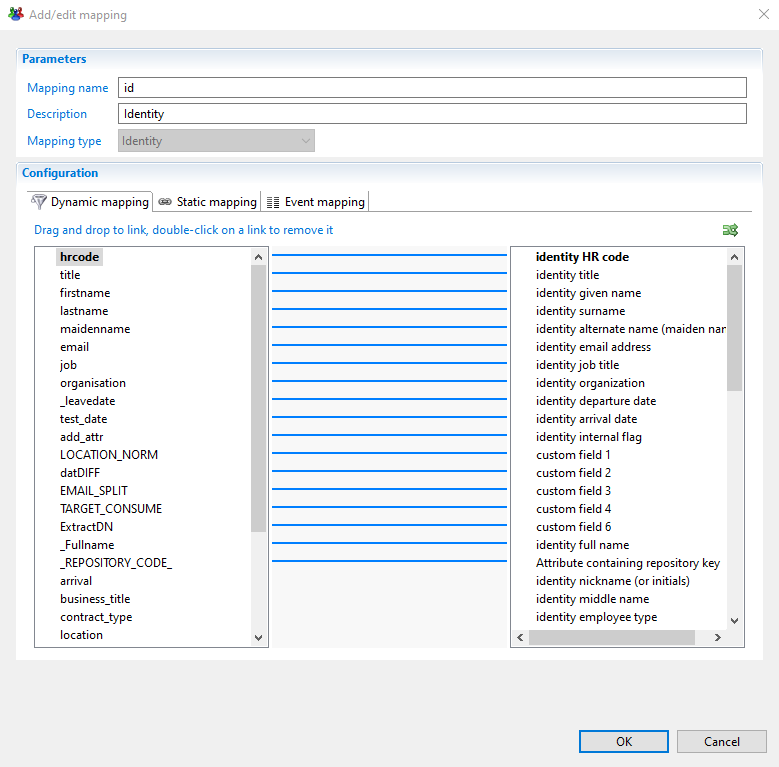

The mandatory attributes to map are:

- The repository code
- The identity HR code
- The identity surname
- The identity given name
- The identity internal flag

### Manager (Organization):

To create an organization manager mapping go to the Mapping tab and add a mapping of type **Manager (Organization)**.

The mandatory attributes to map are:

In the dynamic mapping tab:

- Organization code
- Manager HR code
- Manager's expertise domain attribute

In the static mapping tab:

- Action to do if expertise domain does not exist: Add expertise domain in database

## Associations

After creating the needed mappings in the discoveries files the next step is to associate theses mappings with the application model entities.

For each application model entity you have to choose the discovery file that contains the mappings and choose the mapping corresponding to the entity type

## Generate Files

The RH template model will generate the following files

- `collectors/bw_collecttemplates/new_appmodel/hr.javascript`
- `collectors/bw_collecttemplates/new_appmodel/hr_identities.collector`
- `collectors/bw_collecttemplates/new_appmodel/hr_organization.collector`
- `collectors/bw_collecttemplates/new_appmodel/hr_organization_managers.collector`
- `collectors/bw_collecttemplates/new_appmodel/references/hr_job_titles.collector`
- `collectors/bw_collecttemplates/new_appmodel/references/hr_organization_link_type.collector`
- `collectors/bw_collecttemplates/new_appmodel/references/hr_organization_types.collector`
- `collectors/bw_collecttemplates/new_appmodel/references/hr_references.collector`
- `collectors/bw_collecttemplates/new_appmodel/references/hr_titles.collector`
- `collectors/bw_collecttemplates/new_appmodel/silo_hr.collector`
- `silos/bw_collecttemplates/new_appmodel/new_appmodel_master.silo`

# Repository Template

The repository template for the application model allows the generation of the necessary data collection lines and silos to load repositories, accounts, groups and groups members.

Please follow the steps below to configure your repository data model.

## Silo Settings

When creating the application model base on the HR template it is first necessary to configure the required elements in the **Silo** tab:

- The silo type
- The dependencies if needed
- The location of the importfiles and the itteration if Files iteration if you want to load several files
- The constants

### Mandatory Silo Settings

In order to correctly configure the following elements are mandatory:

- Repository code
- Repository name

---

**Note:** By default The HR model will create a default repository based on silo repository code and name.

---

## Discovery Mappings

Repository application model require the following entity mappings

- Account : to load repository accounts
- Group : to load repository groups and groups membership

---

**NOTE:** If a discovery file mapping the desired importfile attributes does not exist it is necessary to create it.

---

### Account

To create an account mapping go to the **Mapping** tab and add a mapping of type **Account**.

The mandatory attributes to map are:

- The attribute containing repository code
- The account identifier

### Group

To create a group mapping go to the **Mapping** tab and add a mapping of type **Group**.

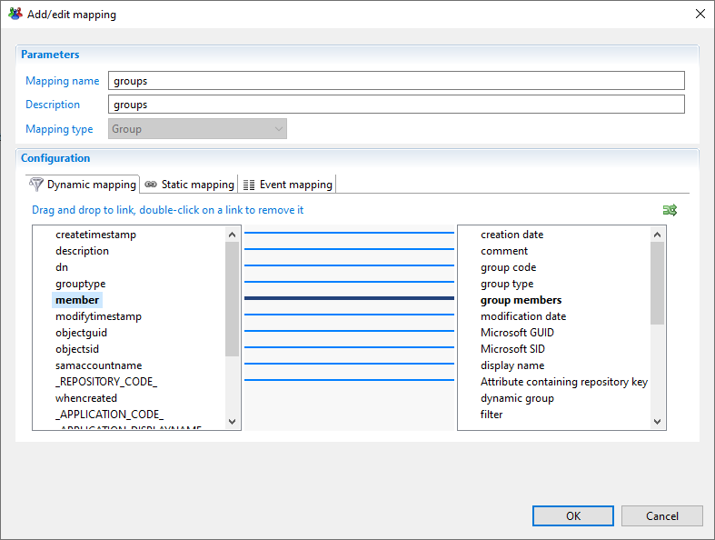

The mandatory attributes to map are:

- The attribute containing repository code
- The group code
- The group member

## Associations

After creating the needed mappings in the discoveries files the next step is to associate theses mappings with the application model entities.

For each application model entity you have to choose the discovery file that contains the mappings and choose the mapping corresponding to the entity type

### Variables

In addition it can be necessary to configure some variables specific to repositories.

- Repository custom type: To be configured when collecting data belong to the same type of application.

__Example:__ collecting active directory domains, this variable should have '**AD**' as value, it is mandatory to resolve multi domains groups membership

## Generate Files

The repository template model will generate the following files

- `collectors/bw_collecttemplates/new_appmodel/repository.javascript`
- `collectors/bw_collecttemplates/new_appmodel/repository_account.collector`
- `collectors/bw_collecttemplates/new_appmodel/repository_group.collector`
- `collectors/bw_collecttemplates/new_appmodel/silo_repository.collector`
- `silos/bw_collecttemplates/new_appmodel/new_appmodel_master.silo`

# Rights Template

Right application model template allows you to generate collect lines and silo to be able to load accounts, permissions and rights.

Please follow the steps below to configure your human resources data model.

## Silo Settings

When creating the application model base on the HR template it is first necessary to configure the required elements in the **Silo** tab:

- The silo type
- The dependencies if needed
- The location of the importfiles and the itteration if Files iteration if you want to load several files
- The constants

### Mandators silo settings

In order to correctly configure the following elements are mandatory:

- Repository code
- Repository name

---

**Note:** By default The HR model will create a default repository based on silo repository code and name.

---

## Discovery mappings

Right application model requires the following entity mappings:

- Accounts: to load repository accounts
- Permissions: to load application permissions
- Rights: to load rights

---

**NOTE:** If a discovery file mapping the desired importfile attributes does not exist it is necessary to create it.

---

### Account

To create an account mapping go to the **Mapping** tab and add a mapping of type **Account**.

The mandatory attributes to map are:

- The attribute containing repository code
- The account identifier

### Permission

To create a permission mapping go to the **Mapping** tab and add a mapping of type **Permission**.

The mandatory attributes to map are:

- The application identifier
- The permission type
- The permission key

### Right

To create a right mapping go to the **Mapping** tab and add a mapping of type **Right**.

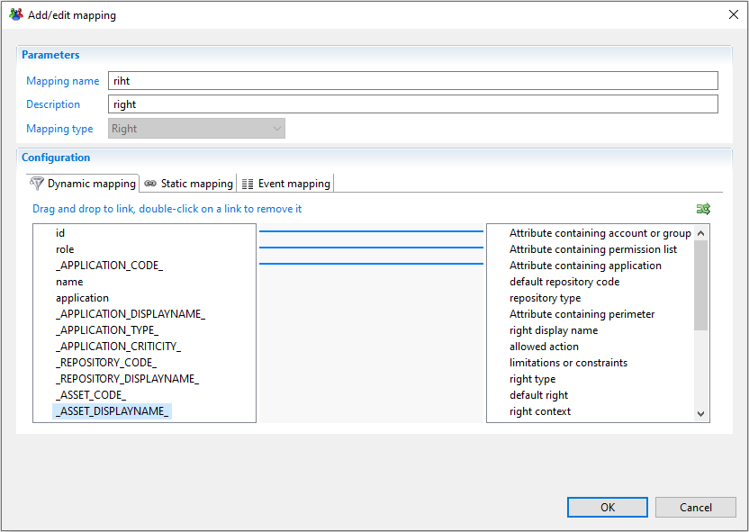

The mandatory attributes to map are:

- The attribute containing application cpde
- The attribute containing list of permission identifiers
- The attrbute containing the account or group identifier
  
## Associations

After the creation of the needed discovery mappings in the discoveries files it is time to associate those mappings with the application model entities

For each application model entity you have to choose the discovery file that contain the mapping and after that choose the mapping corresponding to that entity type

### Variables

In addition it can be necessary to configure some variables specific to repositories.

- Repository custom type: To be configured when collecting data belong to the same type of application.

__Example:__ collecting active directory domains, this variable should have '**AD**' as value, it is mandatory to resolve multi domains groups membership

## Generate files

The right application model will generate the following files

- `collectors/bw_collecttemplates/new_appmodel/right.javascript`
- `collectors/bw_collecttemplates/new_appmodel/right_account.collector`
- `collectors/bw_collecttemplates/new_appmodel/right_permission.collector`
- `collectors/bw_collecttemplates/new_appmodel/right_rights.collector`
- `collectors/bw_collecttemplates/new_appmodel/silo_right.collector`
- `silos/bw_collecttemplates/new_appmodel/new_appmodel_master.silo`
