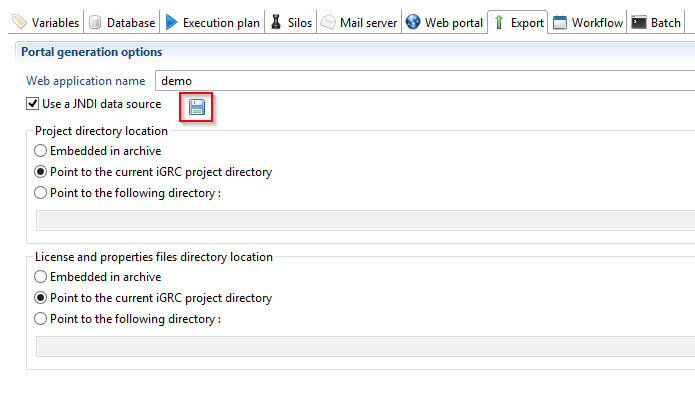
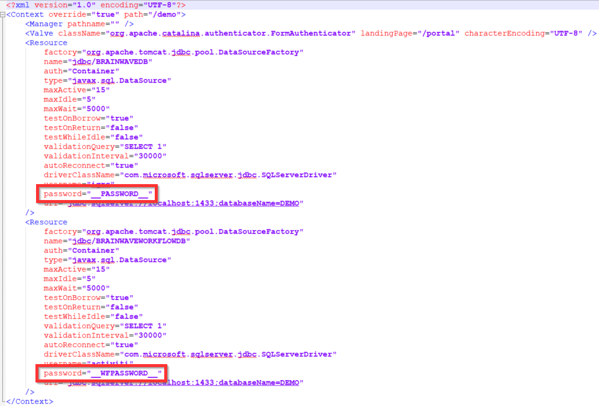
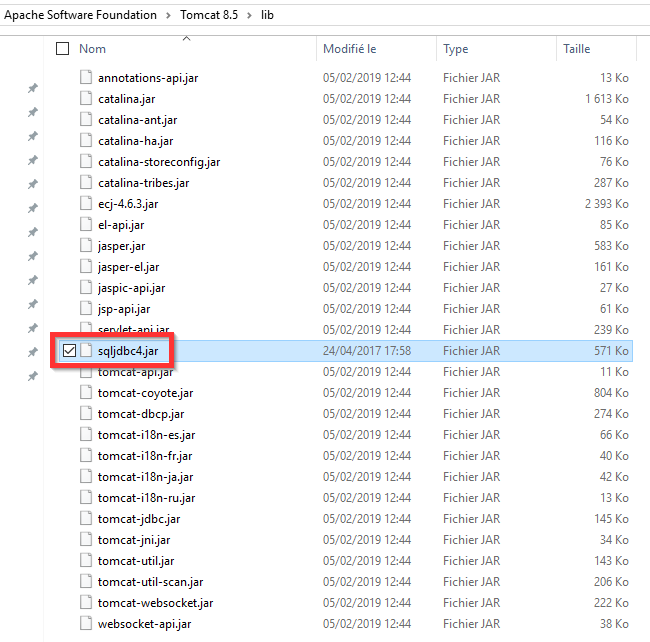
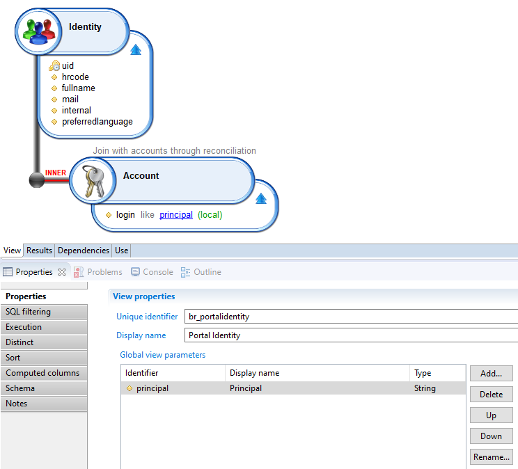

# Parametrization

## Proxy configuration

Proxy configuration in web portal is quite sensitive, and a bad configuration may break `html widgets'`.

> If your are not familiar with what a proxy is, see [Wikipedia](https://en.wikipedia.org/wiki/Proxy_server).  
> In short: `A proxy acts as an intermediary between the clients and the server`

The proxy is setup in the technical configuration's `Web portal` page:  


Here are some guidelines to correctly set **proxy url** in brainwave configuration:

- do not forget protocol (`http://` **or** `https://`)
- use the frontal web server (proxy) name (**not** the ip adress)
- do **not** add a final `/`
- do **not** specify port
- if you edit the `config.properties` file, do not forget to escape `:` with a `\`.

Here is a sample configuration for a config.properties file:

> `proxy.url=https\://brainwave-server.acme.com`

## JNDI configuration

In order not to include the database connection credentials in the WAR file you can choose to configure it to use an external JNDI source. For this you have to choose the option **use a JNDI data source™** in the technical configuration window.



### Generating the JNDI file

The `.xml` file that includes the database credentials is generated by clicking the disk icon outlined in the figure above. You will then be asked to select the destination folder. The generated file will have the following format:

```xml
<?xml version="1.0" encoding="UTF-8"?>
<Context override="true" path="/demo-jndi">
    <Manager pathname="" />
    <Valve className="org.apache.catalina.authenticator.FormAuthenticator" landingPage="/portal"/>
    <Resource
        name="jdbc/BRAINWAVEDB"
        auth="Container"
        type="javax.sql.DataSource"
        maxActive="15"
        maxIdle="5"
        maxWait="5000"
        testOnBorrow="true"
        testOnReturn="false"
        testWhileIdle="false"
        validationQuery="SELECT 1"
        validationInterval="30000"
        autoReconnect="true"
        driverClassName="com.microsoft.sqlserver.jdbc.SQLServerDriver"
        username="igrc"
        password="__PASSWORD__"
        url="jdbc:sqlserver://localhost:1433;databaseName=QA_sqlserver"
    />
    <Resource
        name="jdbc/BRAINWAVEWORKFLOWDB"
        auth="Container"
        type="javax.sql.DataSource"
        maxActive="15"
        maxIdle="5"
        maxWait="5000"
        testOnBorrow="true"
        testOnReturn="false"
        testWhileIdle="false"
        validationQuery="SELECT 1"
        validationInterval="30000"
        autoReconnect="true"
        driverClassName="org.postgresql.Driver"
        username="activiti"
        password="__WFPASSWORD__"
        url="jdbc:postgresql://localhost:5432/activiti"
    />
</Context>
```

The first `<Resource>` bloc corresponds to the options and credentials used to connect to Brainwave's iGRC database. The second `<Resource>` bloc details the credentials and the settings of to the activiti database used within the workflow option. If workflows are not set up the second bloc will not be added.

A JNDI connection allows activation of additional parameters, such as automatic reconnection to a database (`autoReconnect="true"`).

### Generating the web application

The JNDI file will also be generated if you click on `Generate web portal`:  
  
Both files will be generated in the output directory:  


### Deployment

In addition to the modification of the technical configuration, the following steps, to be performed in the tomcat instance, are required to use the JNDI configuration:

1. Shut down the `Tomcat` service
2. Copy the previously created '.xml' into your tomcat instance, in the folder `conf/catalina/localhost/`  
   
3. **Update** the connection password(s)  
   
4. Add the relevant driver to tomcats `/lib` folder to allow connection. The drivers to use are available in the `plugins\com.brainwave.iaudit.database.drivers_1.0.0\drivers` of your igrcanalytics home folder  
   
5. Move or copy the web application (`.war`) to the Tomcat's `webapp` folder:  
   
6. Start the Tomcat server and verify that the login page is shown

> Note that in the log files, the information regarding the Ledger and Workflow databases are not shown when using the JNDI connection:  
> 

> [!warning] For the JNDI configuration to work it is important that the name of the `.xml` file corresponds to the name of the web application.  
> In addition the `hibernate.dialect` defined in the Ledger base tab of the technical configuration during the creation of the datasource in the studio is NOT overridden by the JNDI configuration.  
> As such, it is important to KEEP the value provided by the Product either in the studio or in the generated `datasource.properties` file.

For more information on JNDI connectors please refer to Tomcat's documentation, section **JDBC Data Sources** : https://tomcat.apache.org/tomcat-9.0-doc/jndi-resources-howto.html

### Encrypt passwords

#### Digest method

For Basic form AuthN using a flat file, the password is set in clear in the `tomcat-users.xml` file, which is not a good practice for security purposes.

However, a hash of this password can be configured and put in this file.

To do that, here is the steps to follow:

- Under the `$tomcat_home/conf/server.xml` Tomcat configuration file
- In the `UserDatabaseRealm` realm, add the `CredentialHandler` element with appropriate configuration

```xml
<Engine name="Catalina" defaultHost="localhost">
   <Realm className="org.apache.catalina.realm.LockOutRealm">
      <Realm className="org.apache.catalina.realm.UserDatabaseRealm"
               resourceName="UserDatabase"/>
         <CredentialHandler className="org.apache.catalina.realm.MessageDigestCredentialHandler" algorithm="sha-256"/>
      </Realm>
   </Realm>
</Engine>
```

- In a shell console
- Use the **digest** utility (located under `$tomcat_home/bin` folder) to generate the SHA-256 hash of the password:

```bash
./digest.sh -a sha-256 -h org.apache.catalina.realm.MessageDigestCredentialHandler <YOUR_PASSWORD>
```

> **Note:**
> Hash algorithm must be consistent between the Tomcat configuration and the **digest** utility execution  
> Extension of **digest** utility depends on the OS (`digest.bat` on Windows, `digest.sh` on Linux)
> Extension of **digest** utility depends on the OS (`digest.bat` on Windows, `digest.sh` on Linux)

The output should show the hash result of your password:

```properties
<YOUR_PASSWORD>:93ab5662ab2c66561d2e8af2402534efbc60f9811e770a307aee2d7684767881$1$aa0b6c1be9d8b1b86a60dbef5e0440f3f41a7872681303504d95baa446577096
```

- Copy/Paste the hash result in the `$tomcat_home/conf/tomcat-users.xml` flat file for the appropriate user

```xml
<?xml version='1.0' encoding='UTF-8'?>
<tomcat-users>
   <user username="ACKER11" password="93ab5662ab2c66561d2e8af2402534efbc60f9811e770a307aee2d7684767881$1$aa0b6c1be9d8b1b86a60dbef5e0440f3f41a7872681303504d95baa446577096" roles="user,igrc_administrator"/>
</tomcat-users>
```

- Restart the Tomcat process to take the modification into account the changes

#### JNDI Datasource Encryption

A method has been developed to allow the encryption of the passwords used in the JNDI data source.

This method is included in the tomcat add-ons developed by Brainwave. According to your context (Tomcat and Java versions deployed), the JAR file `bw-tomcat-XXX-addons.XXX.jar` can be requested to your RadiantLogic contact and must be added to the `\lib` folder of the tomcat installation (`<TOMCAT_HOME>`).

> The following steps should only be done when you deploy initial version of Web Portal or if you need to update key (in that case don’t forget to encrypt your password again with the new key).

##### Encryption Key creation

1. Connect to the web server
2. Go to folder `<TOMCAT_HOME>\lib` and open a command-line window
3. Create encryption key for your Tomca instance using the following command line:

```sh
java -jar bw-tomcat-XXX-addons.XXX.jar generateKey AES 256 <TOMCAT_HOME>\conf\db.key
```

This key will be used to encrypt passwords of datasource and used by Tomcat to decrypt database service account password. Ensure that your setup appropriate security on the location of the key.

##### Encrypt Tomcat Datasource passwords

1. Navigate to the folder `<TOMCAT_HOME>\lib`
2. Use the previously generated key to encrypt password of your database access using the following command line. Do this for both, Identity Ledger & Workflow service account passwords.

```sh
java -jar bw-tomcat-XXX-addons.XXX.jar encryptPassword "<clear password>" AES ECB PKCS5PADDING <TOMCAT_HOME>\conf\db.key
```

The encrypted value will be used in next steps.

##### Update datasource with encrypted credentials

Copy the automatically generated `<webapp>.xml` to the folder `<TOMCAT_HOME>\conf\Catalina\localhost`

The deployment descriptor that contains JNDI data source information from generated iGRC Studio looks like this:

```xml
<?xml version="1.0" encoding="UTF-8"?>
<Context override="true" path="/webapp">
   <Manager pathname="" />

   <Valve className="org.apache.catalina.authenticator.FormAuthenticator" landingPage="/portal" characterEncoding="UTF-8" />

    <!-- Identity Ledger Database connections pool -->
    <Resource
        factory="org.apache.tomcat.jdbc.pool.DataSourceFactory"
        name="jdbc/BRAINWAVEDB"
        auth="Container"
        type="javax.sql.DataSource"
        maxActive="15"
        maxIdle="5"
        maxWait="5000"
        testOnBorrow="true"
        testOnReturn="false"
        testWhileIdle="false"
        validationQuery="SELECT 1"
        validationInterval="30000"
        autoReconnect="true"
        driverClassName="com.microsoft.sqlserver.jdbc.SQLServerDriver"
        username="__USER__"
        password="__PASSWORD__"
        url="jdbc:sqlserver://__HOSTNAME__:__PORT__;databaseName=__DATABASE__"
    />

   <!-- Workflow Database connections pool -->
    <Resource
        factory="org.apache.tomcat.jdbc.pool.DataSourceFactory"
        name="jdbc/BRAINWAVEWORKFLOWDB"
        auth="Container"
        type="javax.sql.DataSource"
        maxActive="15"
        maxIdle="5"
        maxWait="5000"
        testOnBorrow="true"
        testOnReturn="false"
        testWhileIdle="false"
        validationQuery="SELECT 1"
        validationInterval="30000"
        autoReconnect="true"
        driverClassName="com.microsoft.sqlserver.jdbc.SQLServerDriver"
        username="__USER__"
        password="__PASSWORD__"
        url="jdbc:sqlserver://__HOSTNAME__:__PORT__;databaseName=__DATABASE__"
    />
</Context>
```

Edit this file to change/add parameters corresponding database information:

- `factory: com.github.ncredinburgh.tomcat.SecureDataSourceFactory`
- `connectionProperties: algorithm=AES;mode=ECB;padding=PKCS5PADDING;keyFilename=<TOMCAT_HOME>/conf/db.key`
- `username`: change with the appropriate values (one for Identity Ledger and one for workflow)
- `password`: copy paste the encrypted values from command described [here](#encrypt-tomcat-datasource-passwords)
- `url`: the url to the database including the `__HOSTNAME__`: your database server name, `__PORT__`: your database listen port, and `__DATABASE__`: your database instance name

After update, you should have deployment descriptor that looks along the lines of:

```xml
<?xml version="1.0" encoding="UTF-8"?>
<Context override="true" path="/webapp">
   <Resources cachingAllowed="true" cacheMaxSize="512000" />
   <Manager pathname="" />

   <!-- Identity Ledger Database connections pool -->
   <Resource
      factory="com.github.ncredinburgh.tomcat.SecureDataSourceFactory"
      name="jdbc/BRAINWAVEDB"
      auth="Container"
      type="javax.sql.DataSource"
      maxActive="15"
      maxIdle="5"
      maxWait="5000"
      testOnBorrow="true"
      testOnReturn="false"
      testWhileIdle="false"
      validationQuery="SELECT 1"
      validationInterval="30000"
      autoReconnect="true"
      driverClassName="com.microsoft.sqlserver.jdbc.SQLServerDriver"
      username="__USER__"
      password="__ENCRYPTED_PASSWORD__"
      url="jdbc:sqlserver://__HOSTNAME__:__PORT__;databaseName=__DATABASE__"

      connectionProperties="algorithm=AES;mode=ECB;padding=PKCS5PADDING;keyFilename=<TOMCAT_HOME>/conf/db.key"
    />

   <!-- Workflow Database connections pool -->
    <Resource
      factory="com.github.ncredinburgh.tomcat.SecureDataSourceFactory"
      name="jdbc/BRAINWAVEWORKFLOWDB"
      auth="Container"
      type="javax.sql.DataSource"
      maxActive="15"
      maxIdle="5"
      maxWait="5000"
      testOnBorrow="true"
      testOnReturn="false"
      testWhileIdle="false"
      validationQuery="SELECT 1"
      validationInterval="30000"
      autoReconnect="true"
      driverClassName="com.microsoft.sqlserver.jdbc.SQLServerDriver"
      username="__USER__"
      password="__ENCRYPTED_PASSWORD__"
      url="jdbc:sqlserver://__HOSTNAME__:__PORT__;databaseName=__DATABASE__"

      connectionProperties="algorithm=AES;mode=ECB;padding=PKCS5PADDING;keyFilename=<TOMCAT_HOME>/conf/db.key"
    />
</Context>
```

Once all modifications applied restart the tomcat service.

## GPortal Access

To login as a user in the Brainwave's portal, it needs to retrieve a Principal provided by the Tomcat server hosting the Portal.

Basically, this Principal is a structure containing:

- An identifier for the user, typically a `samaccountname` or a `login`
- A list of roles

More information can be found about the Principal [here](https://tomcat.apache.org/tomcat-8.0-doc/api/org/apache/catalina/realm/GenericPrincipal.html).

Retrieving all of the above informations to build the Principal is the Tomcat's work and depends on the configured authentication/authorization mechanism.

In all cases, the final goal is to:

- Authenticate & Authorize the user
- Build the Principal (i.e. retrieve user login and user static roles)
- Pass it to the Portal (Brainwave webapp hosted by the Tomcat)

From this Principal, the Portal will be able to:

- Check the existence of the user in the Ledger
- Determine his roles
- Allow the navigation to allowed resources


### AuthN/AuthZ mechanism

When integrating **Brainwave Identity GRC** in your environment, you will be faced with the **authentication** topic:

- How to authenticate your web users?
- What is/are the valid identity sources?

**AuthN** mechanism of Portal users is delegated to Tomcat (aka the container) by implementing and configuring [JAAS](https://docs.oracle.com/javase/7/docs/technotes/guides/security/jaas/JAASRefGuide.html) Tomcat service.

Depending on the AuthN repository, it can be:

- A database
- An LDAP directory
- A flat file (not recommenced, to be used in DEV purposes only)

The AuthN mechanism can rely on several protocols to communicate with the AuthN repository:

- SAML
- LDAP
- JDBC

**AuthZ** mechanism rely on the `role` notion (aka container role). These roles are set after the AuthN step. They are obtained using the authorization process, which can be the same as the authentication one, statically or dynamically.

Dynamic roles are set using business rules based on data from Ledger and are **prioritized** over static roles.

> The `user` role is mandatory to access the Portal.

Apache foundation provides standards Tomcat components to authenticate and authorize. Brainwave exploits some of them:

- [Basic form](./01-basic.md)
- [LDAP](./02-ldap.md)
- [SAML](./03-saml/index.md)
- [HTTP Headers](./04-http-headers.md)

### Portal Identity

Once the user is authenticated and the Principal is built and sent to the Brainwave webapp, the next step is to check the existence of the user in the Brainwave Ledger.

To do so, from the `Principal`, the login is passed on to the view defined in the `user.principal.view` property in the technical configuration's `webportal` tab (`br_portalidentity` by default).



This view is used to retrieve the **Identity** associated to the **Account** returned from the `Principal login`, so that the dynamic roles can be computed (roles are based on identities, not accounts), according to role configuration (see .role files), and added to the list of static roles contained in the Principal.

Notes:

- This can be a business view;
- If multiple identities are returned, the first one is kept (**not recommended!**).
- The fields returned by this view can be used in Pages, using `Principal.fieldname`.

> `preferredlanguage` contains the user's language (either collected or set via the settings in the portal).

### Features & Roles

Once the user Identity is retrieved from the Portal Identity view, the next step is to determine **dynamic roles** (**static** roles are granted accordingly to the configured access).

To do so, the role configuration declared in the project will be used (located under `/webportal/features` folder).

All **dynamic** roles are linked to a `Rule` defined in the `Identities in role` field which determines a list of Identities based on a specific rule (for example, all `Identities` which are `Managers` of an `Organization`).


If the Identity is contained in the list returned by the Rule, the dynamic role is granted to the user.

> Notes: A dynamic role is **prior** to a static role. It means that, if a role can be determined statically (i.e. from the Tomcat) and dynamically (i.e. from Brainwave configuration), the dynamic configuration is applied.

Once dynamic roles are determined, this list is concatenated to the static user roles list and the user is allowed to navigate on the Portal, through all allowed resources (`Pages` and `Widgets`) according to **Features** granted by his **Roles**.


More information about Roles and Features can be found [here](../../../pages/21-features-and-roles/index).
