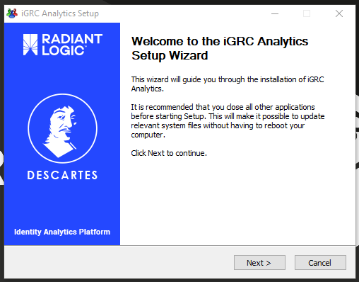
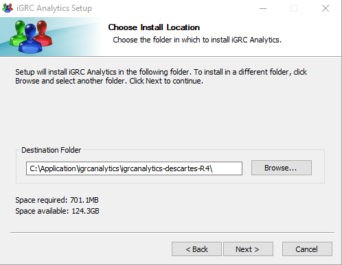
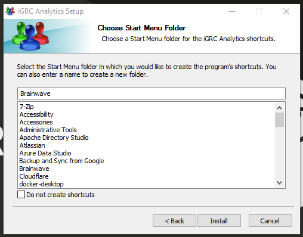
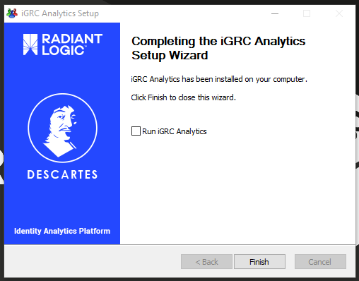
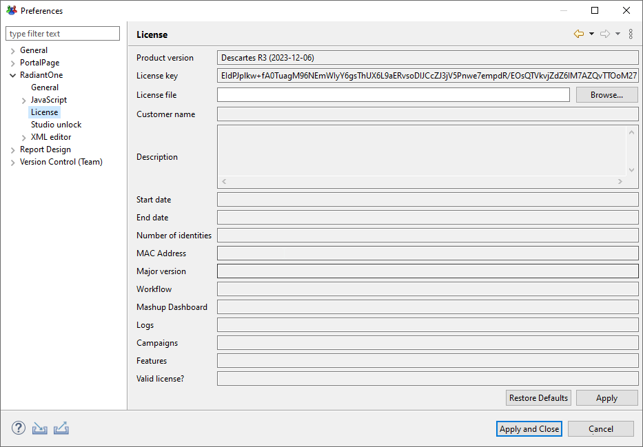
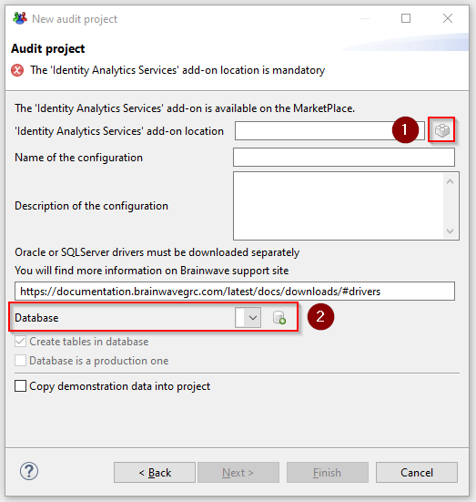
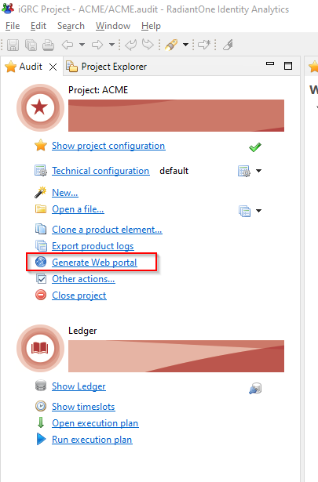
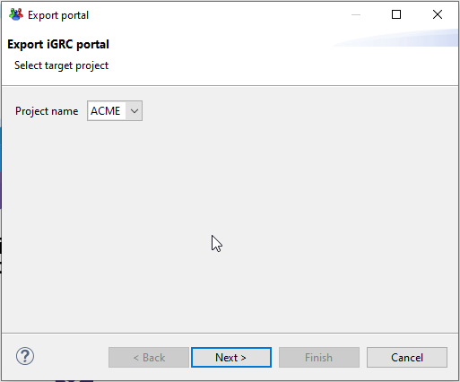
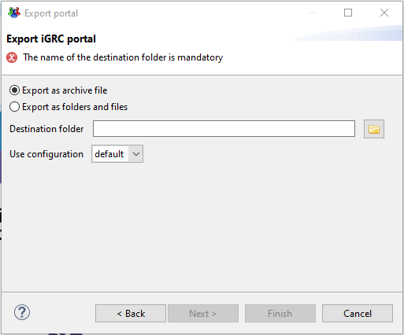

# Installation and deployment

## Installation

By choosing Identity Analytics, you are equipping yourself with a unique solution for streamlining IT controls and enforcing compliance rules.

This document details the main installation stages and the initial parameter setting that will enable you to start using Identity Analytics.

## Identity Analytics Client installation

Please refer to the document "Brainwave Identity GRC Support Matrix" for a detailed description of the additional components supported by Identity Analytics.  

Installation of the software requires Administrator rights to the operating system.

### Database

Configuration of an iGRC project requires one of the following relational database:

- Microsoft SQL Server  
- Oracle  
- PostgreSQL  

## Windows platform

Select installation package based on the target operation system chosen:  

- Launch the executable: `iGRCAnalyticsSetup_win64_XXX.exe`  
- Follow the assistant's instructions.



- Select the installation folder. The default path is `c:\igrcanalytics\`





- Choose the name of the iGRC folder in the Startup menu. If you do not wish to create an item in the Startup menu, check the box "Do not create shortcuts". Then click on the "Install" button in order to launch installation. A success message is displayed when the installation is finished.



## Linux Platform

The application is supplied in archive form in the `.tar.gz` format.

This archive can be decompressed in the destination directory. The application itself is contained in the *igrcanalytics* directory.

This directory may be placed in any application installation path, in accordance with prevailing good practice.

## Completing the installation

### Launching of the application

In Windows, check the "Launch iGRC Analytics" box at the end of the
installation assistant, or double click on igrcanalytics.exe.


### License key

A license file is obligatory for authorization of the application's operation. Obtaining the license file is a two-stage process:

- recovery of the "license key" in the application. This key is unique and linked to the instance (equipment and software);
- obtaining the license file through Radiant Logic by sending the license key and the following information: applicant and type of installation (client station, test server, receipt, production etc).

At the time of the initial launch of the application, the license configuration screen is displayed when a new project is being created or, alternatively, through the preferences menu:

- Choose the "Windows \Preferences" menu;
- Select the menu item "RadiantOne", then "License":



- The "License key" line assigns the unique print of the system on which iGRC is installed. The RadiantOne license is linked to this print and so can only be installed on the system in question;
- Copy (right click "Select all" then right click "Copy") the license key and provide it to your Brainwave business representative in order to obtain the corresponding license file;
- The license file is a .lic file that you must copy on to the local system;
- Click on the "Browse" button to locate and select the license file;
- Check that the license details are correct and then click on "OK".

### Installation of IAS

To install the required default project IAP in a new project click on create a new project in the audit menu on the left hand side:


This will open a new wizard to configure a new project:

- Provide the project information

  
  

- upload the IAP Addon previously downloaded [here](https://marketplace.radiantlogic.com/package/bw_ias/) using the first option



- Configure the connection to the database using the second option by selecting the desired database system and then filling out the database connection information:  


- Finalize the wizard, you should end up with the following display in the studio.  


## Installation of the web portal application

### Web portal installation Prerequisite

Installation of the Identity Analytics Portal web application requires:

- A Java application server complying with the software support matrix (namely Tomcat 9.x);
- An installed, operational instance of Identity Analytics Client.

### Preparation of the Web archive (WAR)

The Identity Analytics Portal application is deployed from a WAR file type Web archive. This file is **generated** from the Identity Analytics Client on to a configured project, once the analyses and reports are configured.

For this, it is necessary to:

- Select the menu item "Generate the Web portal";

  

- Right click on the project and select "export", then in the "Brainwave" section chose "Export Portal ".

  



> The item "**Export portal fragment"** allows regeneration of a ZIP archive that only contains the configuration files of the Web application (for updating an existing application following the addition of personalized reports, for example).  

## Installation under Tomcat

### Deployment of the WAR archive

The WAR archive may be deployed in accordance with the usual method used in Tomcat.

As standard, Tomcat is configured in "automatic deployment" mode, which means that the WAR file may be deposited in the Tomcats webapps directory and the Web application is deployed automatically when the server is restarted.

After deployment of the WAR archive, there is a configuration stage for the rights of access. For this, please refer to the portal administration guide.

## General information

### Notion of perspective

A perspective is a pre-set configuration of panels and tabs suited for a particular activity. IGRC Analytics supplies several default perspectives:

- iGRC Project for the configuration of a project;
- iGRC Collect for the configuration of data collection;
- iGRC Analytics for the configuration of rules and controls;
- iGRC Reports for the configuration of report models.

The icon placed to the right on the perspectives bar enables another perspective to be added.

Modifications to the arrangement are automatically registered in the current perspective.

It is possible to restore the default arrangement of a perspective by right clicking on the perspective button and selecting "Reset".

## Structure of an iGRC project

An iGRC project is a set of files that describes comprehensively the configuration of the iGRC deployment. The files are classified in tree
fashion in a directory that has the same name as that of the project.

The iGRC projects are stored in the application's installation directory, under the installation directory.  

## Silent installation

Once the executable is downloaded, open a command prompt (as an **administrator**) then navigate to the folder where the `exe` is located.  

The command to run is:  

```cmd
<executable-file> /S /D=<installation-folder>
```  

Where:  

- `<executable-file>`: name of the downloaded file (for example: `iGRCAnalyticsSetup_win32_x64_2016-R3-SP5_2017-04-12.exe`)  
- `/S`: Silent installation option  
- `/D=`: Directory where to install iGRC Analytics  

```powershell
iGRCAnalyticsSetup_win32_x64_Descartes-R3_2023-12-06.exe /S /D=D:\igrcanalytics
```

### Scripting recommendation

By default, the silent procedure executes the iGRC Analytics installation in background mode.

If needed, the script can be executed in background mode, using a PowerShell console. Here is the way to manage that:

```powershell  
$INSTALL = "iGRCAnalyticsSetup_win32_x64_2016-R3-SP5_2017-04-12.exe"
$INSTALLDIR = "C:/igrc/"
$expression = "Start-Process -Wait -FilePath $INSTALL -ArgumentList `"/S /D=$INSTALLDIR`""
Invoke-Expression $expression
```

Where:  

- `$INSTALL`: path to the iGCR Analytics binary  
- `/S`: Silent installation option  
- `/D`: Installation folder option  
- `$INSTALLDIR`: Directory where to install iGRC Analytics  
