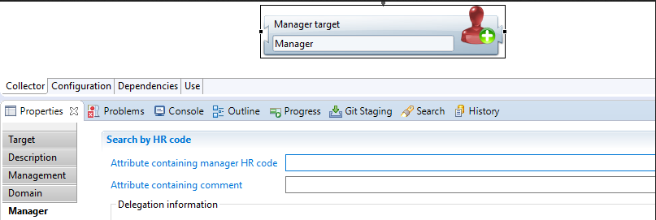
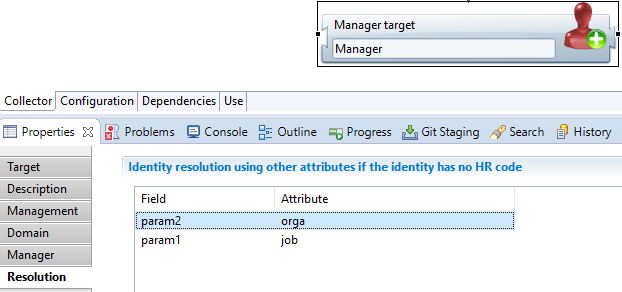
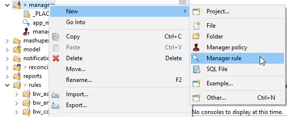

# Table of contents
{: .no_toc .text-delta }

1. TOC
{:toc}
---

# Configuration of the manager policy 

In some cases, you can't directly link a manager to the concept he's managing, because that requires information about the Identity managing the concept:   

The Manager target requires you to provide the HRCode of the manager:   

   

Or if you don't have it, other attributes of the person you want to add as manager, so that the identity can be resolved using these attributes:   

  

## Manager computation using rules

### Warning
{: .d-inline-block }

Important
{: .label .label-red }

When **collecting** managers, you can set *MULTIPLE* managers for the same concept.  
But when using manager **rules** & **reconciliation** policies, you can only set *ONE* manager for the same concept.  
The reason is that this works the same way as the reconciliation (as the name implies).  

---

**Note:** This is true for all versions (as of Jan. 2020).

---

### Implementation

If you don't have any of these during the collect, or if the managers are determined using a more complex logic (organizations or job titles for instance), then you have to use a manager policy:   

   

You can map values of your choice to rule parameters (for instance an organization code, a job title, etc.). For instance:    

   

The rule parameter values will later be used to find the managers of the current entity (as defined in the 'Management' tab of the Manager target).   
In this example, we want Applications manager to be determined by a specific combination of Organization Code and Job Title Code.     

Once your data is populated (rules attributes contain management related information), you can define the according manager rule(s).   
Create a new 'Manager rule' in the managers folder of the project:    

   

In this example, we want to determine Managers using the Job Title and Organization of the Manager. The rule is as follows:   

   

The rule parameters will contain the data provided during the collect in the manager target.  

To complete the process, we have to create a Manager Policy:   

   

And add the rule we just created:   

   

Be careful to select the matching entity (Application, Permission, etc.) as the one defined during the collect in the Manager target.   

Remember to add your manager policy to your execution plan so that management links are computed when creating a new timeslot:    

   

#### Multiple rules   

Note that if you only have multiple rules for managers, you should add a rule type to the manager target:   

   

Here it's simply an attribute added during collect (but it can also come from your discovery):   

   

And use it in the manager policy to filter the computation of links to only the ones matching this rule:   

   

