# Purging data

> [!warning] Purging data destroys data in the database. It is imperative to backup and perform regular archives of your data base before performing any purge of existing data.  
>
> An example to archive your data is the following:  
>
> - You have to define your retention period of active data: for example 12 months
> - Every N months (3 months for example) you should perform a complete backup of the database. This backup should be archived an kept a limited amount of time (eg: 15 months)
> - Following the backup of the database the data can be purged using the CMD script accordingly
> - If necessary the archived data can be restored.

## Purging data using the policies

The purge feature allows to define selective data removal. By implementing this feature, you gain in storage costs and in the long term in performance. For example, you can choose to keep data uploads (timeslots) on a monthly basis after one year and quarterly basis after two years.  

Note that the purge takes into account the workflow activities, workflow compliance reports are totally independent from the purge and kept in the database for forensic analysis purpose:

- Timeslot picking: the old purge system, using the command line `igrc_purge.cmd`, was used to delete a number of timeslots. The purge could only delete the first collected timeslots (the oldest ones). There was no way to delete specific timeslots in the middle of the timeslot history. Now the purge can keep for example one timeslot per week or per month and delete all others
- Workflow compliant: the old purge could delete a timeslot without checking for workflow. This was impossible to keep a timeslot containing a process of a given type. Now the purge is aware of the process launched and does not allow the deletion of a timeslot used by an active process.
- Rule selection: the old system had a primitive way of selecting timeslots to purge. The timeslot selected were in-conditionally the oldest ones. Now, you can give rules to select timeslots to delete using rules. These rules allow to delete more and more timeslots depending on the age of the timeslots.
- Workflow type: old timeslots used for launching workflow can have different rules for the purge to be able to keep those timeslots longer even if the workflow is finished. This lets the portal access data when looking at the history of the process.

## Define the purge

The purge needs to be defined in the technical configuration under purge tab in iGRC studio. It means that you can define a different purge policy in two technical configuration. Purge configuration is divided into two parts. In the two parts, you define which timeslots you want to keep based on a list of rules called criteria :

- timeslot retention criteria: used to define criteria to keep timeslots depending on the age of the timeslot. It allows you to define criteria that keep the first or last timeslot of a period (week,month,quarter,..) beyond a duration of time.
- workflow retention criteria: used to define criteria to keep timeslots depending on the type of workflow they contain. It allows you to define criteria that keep timeslots containing certain type of workflow for a duration of time, even if you have a timeslot criteria which allows deleting a timeslot. Workflow criteria prevent the purge if timeslot is corresponding to a workflow criteria.

The criteria are used to define what you keep and not what you delete !


## Add new criteria

### Timeslot retention criteria

In the "Purge" tab of the configuration, select Add to add criteria in the "Purge of timeslots" part:


Select the timeslot to keep using this criteria:  


Select the time basis of the purge (timeslots kept on a weekly, monthly... basis):  

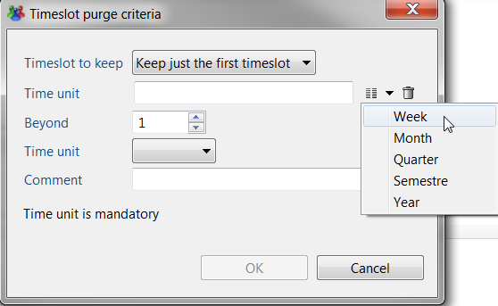

Select the time after which to apply the criteria:  

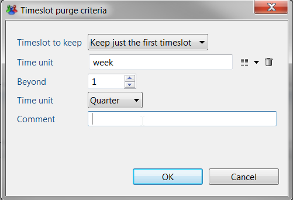

And finally add a comment:  


### Workflow retention criteria

In order to define a selective purge regarding timeslots, the first step here is to define workflow types in the workflow tab:

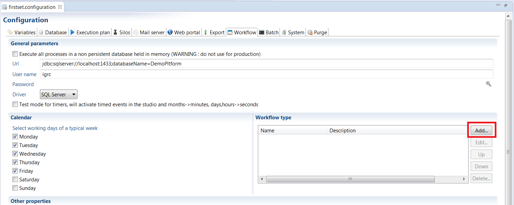

Precise name and description of the different types of workflow you want to add:

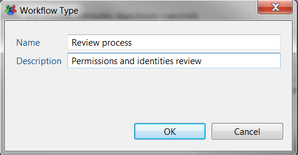

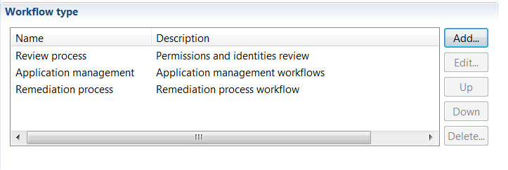

When defining or editing workflow advanced properties, you then will be able to add the related workflow type:  

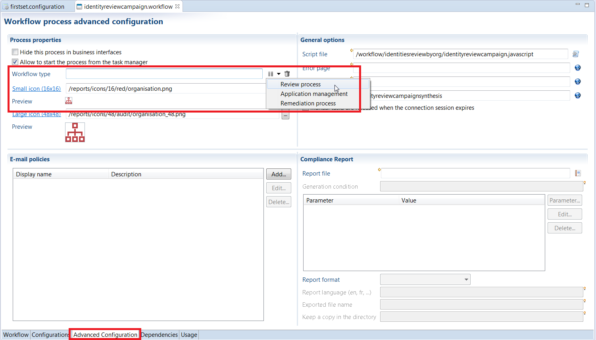

The criteria definition for timeslots having active workflow is done the same way as for standard timeslot criteria, beginning with the selection of workflow type:  

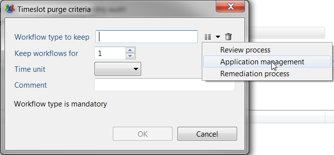

And then the retention period:  

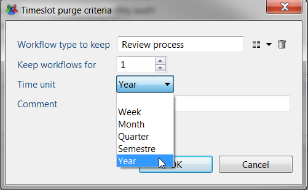

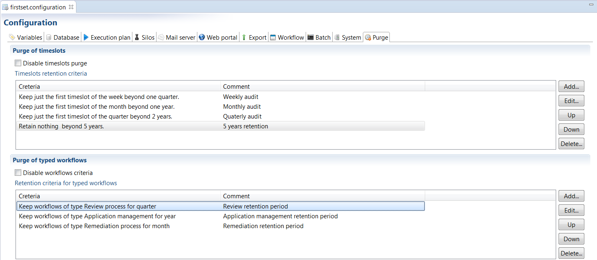

### Review decision purge

Some elements in the database are not linked to a timeslot, as a result the previous criteria do not delete these elements.  
These correspond to review decisions, i.e. tickets, and the activiti processes and variables. As a reminder activiti is the workflow engine used.  

To configure the purge of decisions it is necessary to configure a retention period in months. All elements beyond this period will be deleted.  


> To deactivate the deletion of decisions you can either:
>
> 1. Disable the purge of tickets using the check box
> 2. Set a retention period of 0

#### Limitation

1. Currently IAP review decisions are not deleted
2. Activiti processes that are not linked to a ticket in the database are not deleted

## Simulate the purge

Once you have defined your criteria, we strongly recommend to launch a simulation in order to check which timeslots will be removed and why.

To do so, open the execution plan detail from your project:


Then click on "Run purge simulation of timeslots"

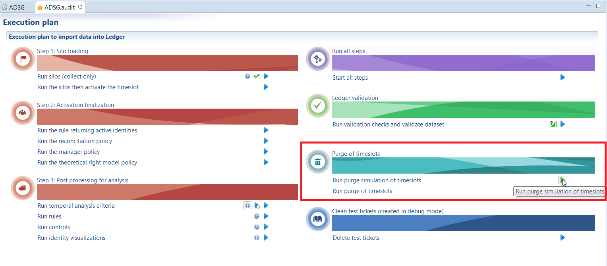

A window opens allowing you to finally check the removed timeslots and the reason why:  


## Schedule the purge  

Once Purge configured, you are able to schedule it using the batch `igrc_purge.cmd` available in the igrcanalytics installation folder:

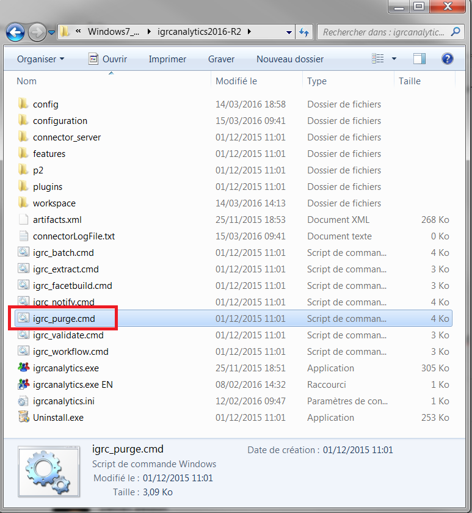

## Purging data using criteria

When using purge criteria, the policy is ignored and it is up to the user to chose:  

- The keep unit: the unit on which to calculate the purge. Three units are possible 'days', 'timeslots' or 'states'.
  - days: number of days to keep
  - timeslots: number of timeslots to keep
  - states: type of timeslot to delete: I for sandbox, W for activated timeslot, D for hidden
- The keep value: the number of above mentioned units to keep for days and timeslots

### Manual execution  

To execute the purge of data open a CMD or powershell window and navigate to the home installation folder. Your can then execute the following command:  

```sh
igrc_purge.[sh|cmd] <project name> <config folder> <keep value> <keep unit> <action>`
```

This command is detailed bellow:  

```sh
"Usage: igrc_purge <project name> <config folder> <config name> <keep value> <keep unit> <action>"
"<config folder> can contain several of these files:"
"- project.properties: file containing project configuration variables"
"- datasource.properties: file containing database connection configuration"
"- mail.properties: file containing mail server connection configuration"
"- workflow.properties: file containing workflow database connection configuration"
"- license.lic: file containing the Brainwave product license"
"<config name> is the name of the configuration (defined in a project .configuration file)"
"<keep value> is a positive value expressed in <keep unit>"
"<keep unit> is either 'days' or 'timeslots' or 'states'"
"<action> is either 'PURGE' or 'SIMULATE'"
"If unit is 'states', then value is the status of timeslot (I for sandbox, W for activated timeslot)"
"If <keep unit> and <keep value> are empty, purge will load timeslots retention criteria from configuration)"
"Command line example: igrc_purge demonstration /var/igrc/config default 365 days PURGE"
"Example: igrc_purge demonstration /var/igrc/config default IW states PURGE"
"Another example to lunch purge from configuration: igrc_purge demonstration /var/igrc/config default PURGE"
"Note: Reference timeslots will NOT be purged"
"Note 2: Last timeslot will never be purged. A newer timeslot must be ingested before starting the purge."
```
