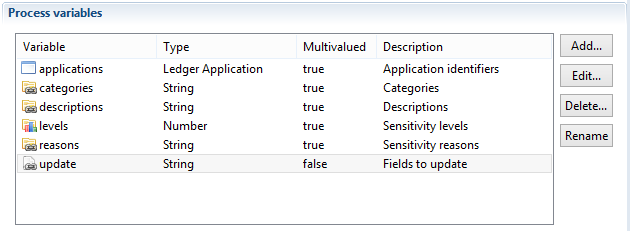

# Table of contents
{: .no_toc .text-delta }

1. TOC
{:toc}
---

# Context

The 'Application metadata update' and 'Permission metadata update' workflow activities allow to change information stored for an application or a permission respectively.   

For an application, metadata can include:    

- A category
- A sensitivity level  
- A reason accounting for the sensibility level
- A description

For a permission, metadata can include:    

- Whether it is flagged as managed or not
- Asensitivity level  
- A reason accounting for the sensibility level
- A description

# Procedure

## Application metadata

The Application metadata update activity allows to update the information stored for an application:     

      

Its configuration is done the the Metadata subtab and is detailed as following:    

        

- applications: A multi-valued variable containing the list of applications to update  
- update: The list of fields to update and is any combination of the letters C, R, L and D. Letters can be in any order, lower or upper case
  - C: categories
  - R: sensitivity reasons
  - L: sensitivity levels
  - D: descriptions.
- categories: The variable containing the new categories. It can be multi-valued or not (see below)
- reasons: The variable containing the new sensitivity reasons. It can be multi-valued or not (see below)
- levels: The variable containing the new sensitivity levels. It can be multi-valued or not (see below)
- descriptions: The variable containing the new descriptions. It can be multi-valued or not (see below)   

These variables should be declared as all variables used during workflow in the workflow configuration tab. They should be declared in a similar fashion to the following caption:    

      

| **Note**:     The variables categories, reasons, levels and descriptions can either be multi-valued or mono-valued:  - If they are multi-valued, their size should match the size of the applications variable and they can contain values different for each application.  - If they are mono-valued all the applications referenced in the applications variable will have the same value.   These parameters are independent from one another. As such any combination is admissible.  For example categories can be mono-valued whereas the others are multi-valued.|

# Permission metadata

The Permission metadata update activity works in a similar way.   

      

- permissions: A multi-valued variable containing the list of permissions to update  
- update: The list of fields to update and is any combination of the letters M, R, L and D respectively denoting managed, sensitivity reasons, sensitivity levels and descriptions. Letters can be in any order, lower or upper case
- managed: The variable containing the new flag indicating if the application is managed or not
- reasons: The variable containing the new sensitivity reasons
- levels The variable containing the new sensitivity levels
- descriptions The variable containing the new descriptions    

Their declaration, performed in the configuration tab, should resemble the following caption:  

      
