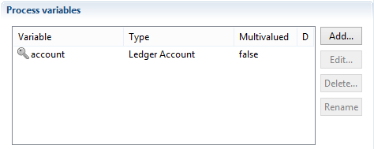

# Table of contents
{: .no_toc .text-delta }

1. TOC
{:toc}
---

# Context

There are four workflow activities dedicated to the management of account reconciliations:    

- 'Reconciliation update' activity allows to change the identity reconciled to an account
- 'Delete reconciliation' activity will delete the reconciliation information for an account
- 'Reconciliation of a service account' activity will indicate that the account is reconciled but has no owner
- 'Reconciliation with person who left the company' activity will indicate that the account is reconciled with an identity which is not anymore present in the current timeslot  

# Procedure

These four activities can be found in the workflow palette under the 'Reconciliation' category:

        

## Reconciliation update activity

This activity is used to set/change the identity reconciled to a given account. Its configuration is:     

        

**where**:

- account is a variable containing the account to reconcile
- identity is a variable containing the new identity to reconcile to the account
- comment is an optional variable containing a comment to associate to the reconciliation information  

These variables must be declared as in:     

        

## Delete reconciliation activity

This activity is used to remove all reconciliation information for a given account, whether the account is actually reconciled to an actual identity, is a service account or is reconciled to a a person who left the company.     
Its configuration is:     

        

where account is a variable containing the account whose reconciliation is to be deleted. It must be declared as:    

        

## Reconciliation of a service account activity

This activity allows to categorize a given account as being a service account, i.e. an account without a proper owner. Its configuration is:    

        

**where** :

- account is a variable containing the service account
- reason is a variable containing the reason why this account does not belong to a proper owner. It can be any value but the 'service' value is recognized by the product's standard reports to flag service accounts
- comment is an optional variable containing a comment to associate to the reconciliation information

The declaration of these variables must be:    

        

## Reconciliation with person who left the company activity

This activity is to be used when an account needs to be reconciled to an identity which is not part of the current timeslot. Note that the identity must have been present in the Ledger at some time (in the archived timeslots).    

Its configuration is:   

        

**where** :     

- account is a variable containing the account to reconcile
- identity is a variable containing the identity who left the company
- leave\_date is the date since which the identity left

The declaration of these variables is:    

        
