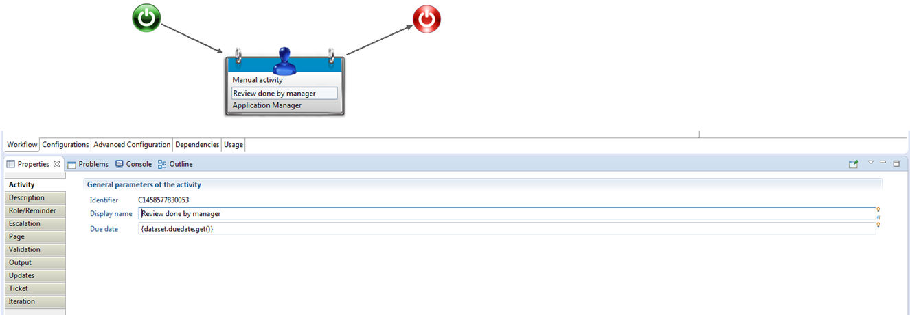
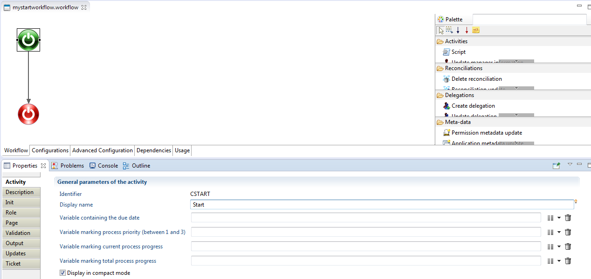
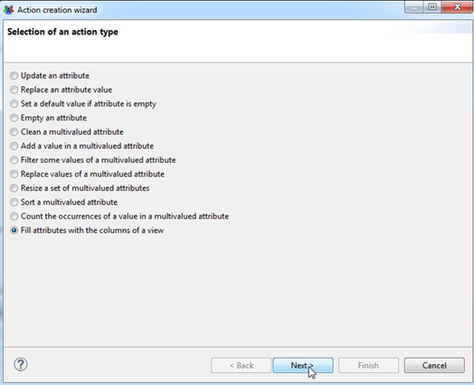

# Table of contents
{: .no_toc .text-delta }

1. TOC
{:toc}
---

A start activity corresponds to a manual activity with a reduced number of configuration parameters. As such these two components can be described together. We will focus on detailing the configuration of the manual activity component first. All parameters and actions are listed in the "properties" tab of the components. These actions are treated sequentially during the process.   

A manual activity is used when it is required that people interact with the process through the iGRC web portal.   
The manual task is made eligible for a candidate (_e.g._ all persons of the support service). Once the candidate has taken the task, the manual task switches to another state and it disappears from the manual task of the other candidates. The task remains in the task list of the person who takes it as long as he has not released it.   

From the iGRC backoffice pallete, drag and drop the "manual activity" component to our existing workflow. Select the manual activity component and click on "properties" to display all the corresponding sub tabs to configure.   

# Activity

The "Activity" sub tab of the manual activity component needs both information the "display name" as well as the task "due date" (see [Difference between task due date and task expiration]({{site.baseurl}}) for more information on the due date).   

   

In the case of the start component the activity tab allows the configuration of the variables related to the task itself and created by user in the configuration tab.   
As presented in the figure above, variables are:   

- the due date
- the process priority
- the current progress
- the total progress.

# Description

The description sub tab allows you to add a textual description to the manual activity.

# Init

This tab is only available for the start component and lists the variables values of the workflow instance can be updated into the "Init" tab.   

   

# Role/Reminder

This tab allows the definition of the candidates being eligible to perform the task through the "Role" item. In other words it nominates through an audit rule, the candidates who have the right to launch the process instance. Once created, such audit rule is linked to the process via its configuration tab, under the "Process roles". Please see the page on [Roles]({{site.baseurl}}) for more information.       

In this example, this manual task should be performed by application managers.   
It is also possible to configure notifications. More information on how to perform detailed configuration of email notification are available on the following pages on [E-mail notifications]({{site.baseurl}}) and [Reminders, Escalation and task expiration]({{site.baseurl}}).

# Page

This tab is used to generate or customize (by users) the associated web page of a workflow. A workflow Gui or page interacts with the workflow database and is produced using Pages language (please refer to the corresponding documentation for more information). The web pages allow to dynamically visualize or modify the data in the web portal.   

    

An existing home page can be used, however there is a possibility to generate a page form. An additional features can be enabled to allow API's for an intuitive edition of the content of the page being generated. Workflow variables are available through pages via "Record Object".   
Example: TaskRecord =\> task = TaskRecord (create "my\_start\_workflow\_launcher"). “task.VariableName†permits to manipulate workflows variables.   

      

Under the "page" tab, one should declare the list of the variables that you want to display their values inside the form presented in the web portal. This example below display profiles of the "application A" in order to review them.

      

# Validation

The validation sub-tab offers the capability to use java scripting to validate workflow activity:    

      

# Output

The output sub-tab fills the variables with the values associated to the corresponding task:   

      

# Update

The Updates sub-tab is the section from which some tasks can be performed on workflow variables values such as filling variables with the columns of an audit view (ledger data), clean or resize multivalued variables, etc. The full list is provided in the figure below:     

      

      

# Ticketing

The Ticket sub-tab enables a "ticketing" feature through which a workflow instance status can be stored into the ledger. "Ticketing" logs the action performed from the workflow into the ledger. Such feature will help to save the status of the performed actions during the workflow execution while retrieving them later to display to the process owner into a dashboard after the workflow task completion.   

For a given workflow instance, one can associate a ticket (called ticket log). The ticket log is itself associated to a ticket action which itself is associated to a ticket review.    
Ticket review indicates the impacted object in the workflow process and the associated action (_e.g._ the action of deleting /creating an account or revoking/validating a permission associated to a profile).  

      

| **Note**:    a workflow instance references a ticket log and a manual activity reference a ticket action. A ticket log can reference several ticket actions. More information on workflow tickets is available at [Tickets]({{site.baseurl}})|

# Iteration

The manual activity configuration ends with the iteration tab which creates multiple instances of the same activity when enabled. The iteration feature only exists within a manual activity component or a sub process call or even under an email notification component.   
For instance if a manual activity references a review of an application profiles, the role is "application manager" and iteration is enabled, the same workflow instance will be created as much as there exists an application to review by manager. Note that, in most cases variables impacted by the iteration should be cleaned or resized inside the Update sub tab.  

      
