# Table of contents
{: .no_toc .text-delta }

1. TOC
{:toc}
---

You can update workflow variables almost anywhere.      
Variable modifications are done either in the "Updates" tab of components (as shown here for the Start component, but this is also available for most of the components) :     

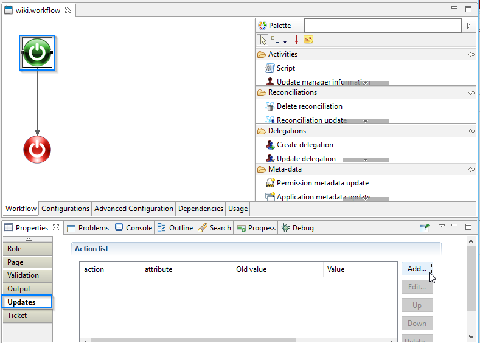    

or using a specific component :     

    

There are multiple modification functions :     

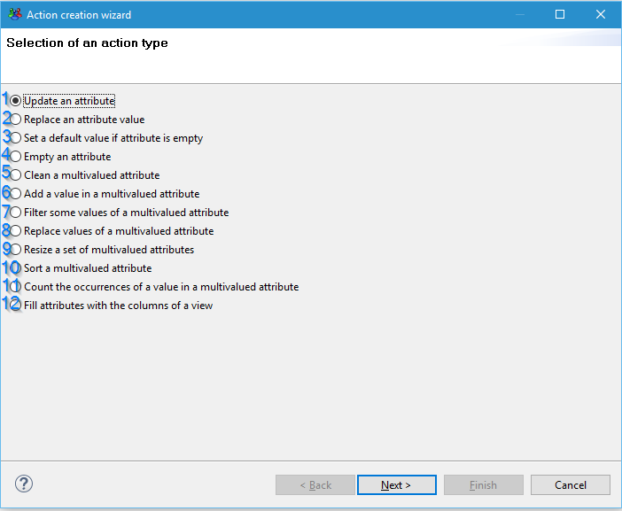    

# Update an attribute

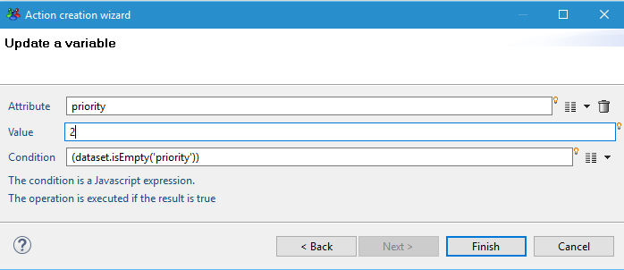    

Attribute: the workflow variable to update    
Value: the variable's new value (you can also use javascript)     
Condition: the variable will be updated if the condition is empty or if the result is true.     
Example : set to the "priority" variable to "2" if it is empty.  

# Replace an attribute value

    

Attribute: the workflow variable to update     
Old value : the value to replace with the "value" field's content     
Value: the variable's new value (you can also use javascript)     
Condition: the variable will be updated if the condition is empty or if the result is true.     
Example : set the "priority" variable to "3" if its value is "2".-   

| **Note**:    this does not work for multivalued attributes, see 8) instead. |

# Set a default value if an attribute is empty

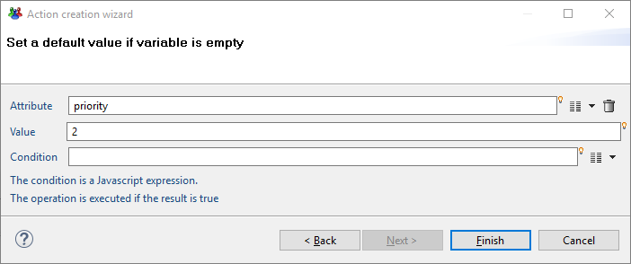    

Attribute: the workflow variable to update     
Value: the variable's new value (you can also use javascript)     
Condition: the variable will be updated if the condition is empty or if the result is true.     
Example : set to the "priority" variable to "2" if it is empty     

| **Note**:    this also works for multivalued attributes. |

# Empty an attribute

    

Attribute: the workflow variable to update     
Condition: the variable will be updated if the condition is empty or if the result is true.     
Example : set to the "priority" variable to null (empty).    

| **Note**:    this also works for multivalued attributes.  |

# Clean a multivalued attribute

    

Attribute: the main workflow variable to update     
Options:  

- Remove empty or null values: clean up the list to keep only actual values  
- Remove duplicate values: clean up the list to keep unique entries  
Attribute list to update synchronously: the list of attributes that will also be cleaned.  

Condition: the variable will be updated if the condition is empty or if the result is true.  
Example : remove all identitiesStatuses and identities where identitiesStatuses is empty or null.  

| **Note**:    this action is meant to be usable on synchronized attribute lists (often used in review workflows).   Let's say that we have the following variables before calling the clean action :  - identitiesStatuses [reviewed, reviewed, null, reviewed, , null] - identities [UID1, UID2, UID3, UID4, UID5, UID6]  After calling the clean action in the screenshot above, we would have :  - identitiesStatuses [reviewed, reviewed, reviewed]  - identities [UID1, UID2, UID4]|  

# Add a value in a multivalued attribute

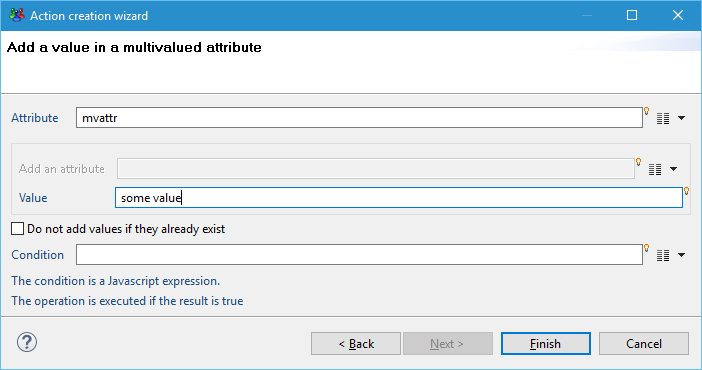    

Attribute: the main workflow variable to update      
Choose one from:   

- Add an attribute: the attribute (multivalued or not) to add to the attribute
- Value: the value to add to the multivalued attribute (you can use javascript)

Do not add values if they already exist: only add new values to the attribute     
Condition: the variable will be updated if the condition is empty or if the result is true.     
Example : add "some value" at the end of the "mvattr" attribute.  

# Filter some values of a multivalued attribute

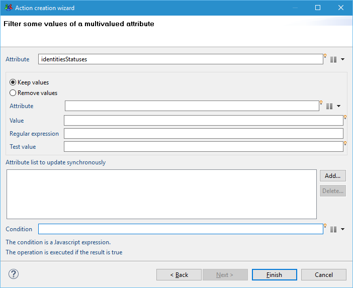    

Attribute: the main workflow variable to update     
Option:   

- Keep values: keep the main variable values matching the settings
- Remove values: remove the main variable values matching the settings   

Choose one from:   

- Attribute: the attribute (multivalued or not) used to filter values of the main attribute
- Value: the value use to filter the main attribute (you can use javascript)
- Regular expression: use to filter the main attribute   

Test value: provided for you to test values against the regular expression.    
Condition: the variable will be updated if the condition is empty or if the result is true.   
Example : add "some value" at the end of the "mvattr" attribute.

# Replace values of a multivalued attribute

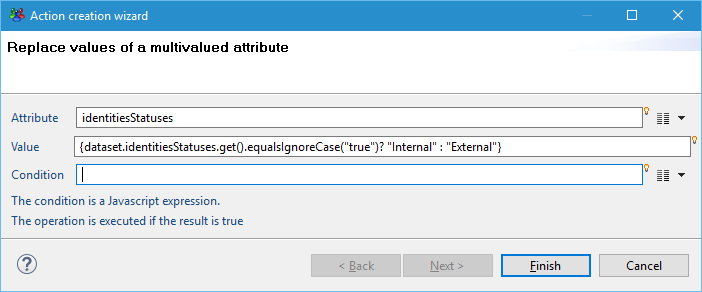    

Attribute: the workflow variable to update.     
Value: the value used to replace the main attribute's value (you can use javascript).    
Condition: the variable will be updated if the condition is empty or if the result is true.     
Example : replace all values "true" to "Internal", other values to "External".  

| **Note**:    that the the multivalued attribute is iterated on in the value field, this is why the javascript uses a .get(). |

# Resize a set of multivalued attributes

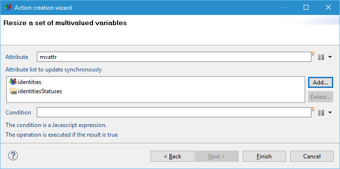    

Attribute: the workflow variable that is used to resize other variable.     
Attribute list to update synchronously: the list of attributes to resize.     
Condition: the variable will be updated if the condition is empty or if the result is true.     
Example : resize "identities" and "identitiesStatuses" to the size of the "mvattr" attribute.

| **Note**:    there are two scenarii :  - the attribute to resize is too long -\> it is truncated.  - the attribute to resize is tool short -\> empty values are added. |

# Sort a multivalued attribute

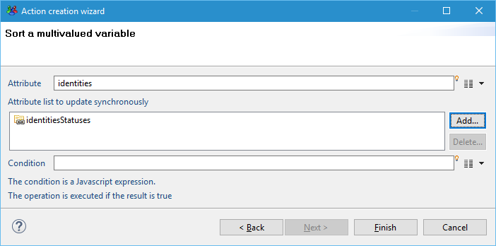    

Attribute: the workflow variable that is used for the sort order.      
Attribute list to update synchronously: the list of attributes to sort with the same order as the main attribute.     
Condition: the variable will be updated if the condition is empty or if the result is true.     
Example : sort "identities" and also "identitiesStatuses" in the same order.  

| **Note**:    this is usefull when doing multiple iterations on different attributes, since you will want to have the main iteration variable sorted.|

# Count the occurences of a value in a multivalued attribute

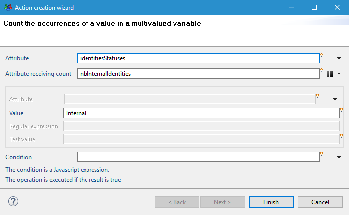    

Attribute: the main workflow variable you want to count values from.     
Attribute receiving the count: the attribute that will contain the result (has to be a number).    
Choose one from:   

- Attribute: the attribute (multivalued or not) used to count matching values of the main attribute (use the same attribute as the main attribute if you want to count the number of entries)  
- Value: the value use to count the number of matching values in the main attribute (you can use javascript)
- Regular expression: use to count the number matching values of the main attribute
Test value: provided for you to test values against the regular expression.  
Condition: the variable will be updated if the condition is empty or if the result is true.  
Example : count the number of time "identitiesStatuses" contains "Internal" and store if in the "nbInternalIdentities" attribute.

# Fill attributes with the columns of a view

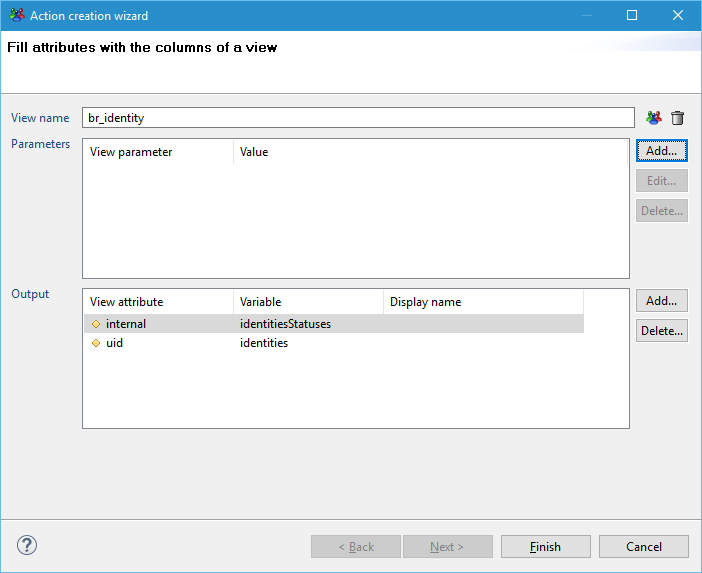    

View name: the view to call.     
Parameters: used to pass workflow variables to the view.     
Output: mapping between the view columns and the workflow variables to fill.  

| **Note**:    be careful when passing parameters to the view. If you want to pass a multivalued attribute, remove the .get() to pass all the values of the multivalued attribute.  |
