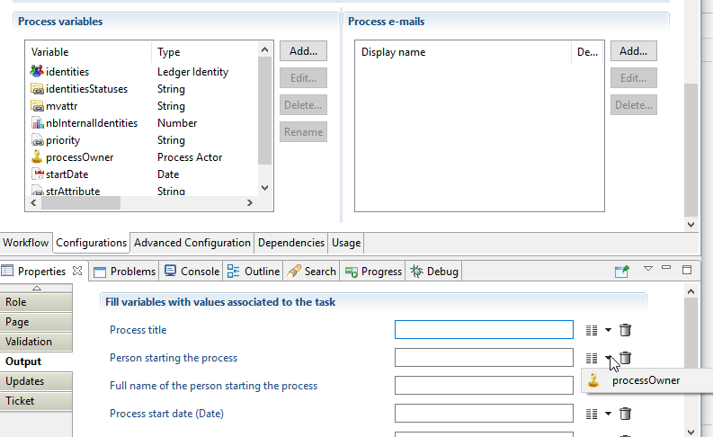

---

The workflow engine allows you to use the same variables type as in the discoveries or collectors:    

- Boolean     
- Date 
- Number 
- String     

But also provides new variables types:    

- Ledger Account 
- Ledger Application 
- Ledger Asset 
- Ledger Group 
- Ledger Identity 
- Ledger Organisation 
- Ledger Permission 
- Ledger Repository 
- Process Actor 
- Process Actor Organisation 
- File 

Technically, these new types are Strings, they contain the corresponding concept uid. But you will **need** to use them since some **interfaces filter** the list of available attributes to a certain type, as illustrated here :   

    

_Event if the process above has many variables, only the correct variable type is available when retrieving the "Person starting the process"._   

All the types can be used for mono- or multi-valued attributes.   
The types will also be leveraged by the pages wizard.
